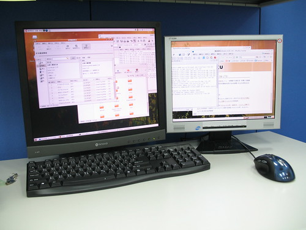

前幾天把 Radeon 9550 從 Yuren's Info Area 拿下來以後，就迫不及待的裝到我的 Desktop 上。Windows 上設定當然是很簡單，稍微更改一下 ATI 專用軟體的設定就好了。在 Linux 上嘛，就要稍微設定一下了。  
  
我電腦的顯示卡是洛克人 9550，螢幕 17" 的是 AG Neovo F-417，15" 的則是 cmv CT-529A。安裝 fglrx 驅動程式的步驟就不說了，很多地方都可以查的到。  
  
接著就要修改一下 /etc/X11/xorg.conf，首先在 Section "Device" 加入以下設定：  

>   
> Option "DesktopSetup" "0x00000200" #這是設定雙螢幕顯示是水平顯示（一左一右）  
> Option "MonitorLayout" "AUTO, AUTO" #兩個螢幕的 layout 用自動的  
> Option "HSync2" "28-65" #第二個螢幕的水平掃描頻率（請參照你自己的螢幕設定）  
> Option "VRefresh2" "50-78" #第二個螢幕的垂直掃描頻率（請參照你自己的螢幕設定）  
> Option "Mode2" "1024x768" #第二個螢幕的解析度設定  
> Option "ScreenOverlap" "0" #兩個螢幕要重複的像素點要多少  

  
  
接著新增第二個螢幕的設定：  

>   
> Section "Monitor"  
> Identifier "CT-529A"  
> Option "DPMS"  
> HorizSync 28-65  
> VertRefresh 50-78  
> EndSection  

  
  
這樣就大功告成了。不過別忘了只有使用 fglrx 驅動程式的才能這麼設定，別的驅動程式有別種方法。完整的 xorg.conf 在[這裡](http://yurenju.googlepages.com/xorg.conf)  
  
