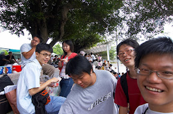
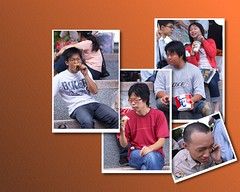

From [kyozi 懇親團](http://picasaweb.google.com/yurenju/Kyozi)

  
  
昨天跟 OD, Znikang 約好九點在台中火車站碰面後，就浩浩蕩蕩的前往成功嶺了。進去前我們還買了兩份肯德雞六塊雞套餐（唉，沒機會讓他演『這不是肯德雞』了』）、阿水師豬腳，準備讓他吃到爽。  
  
進去看到 kyozi, 哈！頭髮真的有夠短的。不過其他地方倒是沒什麼變啦。他同學還幫他帶了心愛的 IBM ThinkPad X31、Nikon D70 再加幾支鏡頭來，讓悶了一個禮拜的他玩一玩相機。目前手邊的照片大概就是相簿裡那幾張，其他的在 Zniknag 那邊，晚點上傳。  
  
