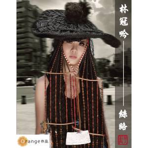

  
[林冠吟 - 絲路](http://www.kkbox.com.tw/funky/web_info/RGAuh-Uql5.unQW00JdR008l.html#1)  
  
自從發了第一張專輯後就很久沒出現的林冠吟，又要發片囉。這次 KKBox 上有兩首搶先聽的歌曲，冒險愛情、絲路。不過我比較喜歡絲路這首歌 :)  
  
前奏剛開始時，我還皺了一下眉頭。這個編曲的有夠偷懶的，類似的編曲在上張專輯就出現過了。慢慢聽完這首歌後，發現整首歌的節奏都很平緩，在副歌方面起伏也不大，不過這樣的曲風意外的讓人覺得平靜。而在歌詞轉折處也讓人起了一堆的雞皮疙瘩阿…。  
  
不過再說一次，這首歌的編曲處理得很粗糙，是這首歌的敗筆。反而後面的電音版編曲還好的多。