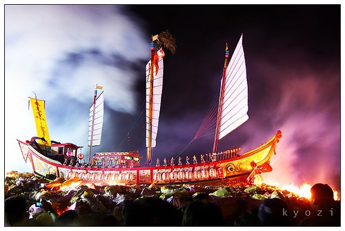
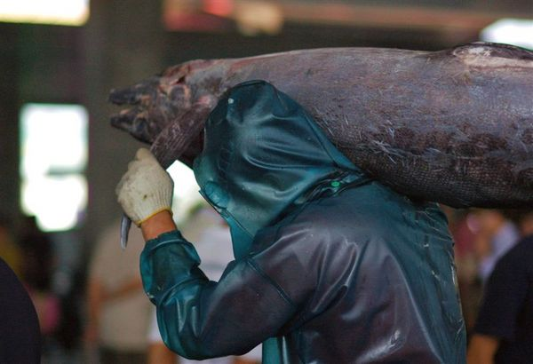
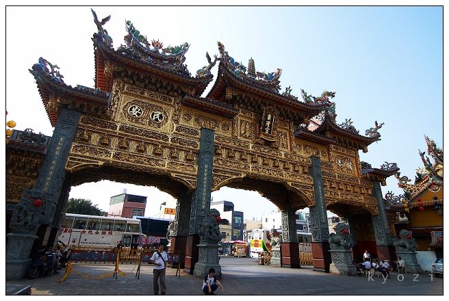
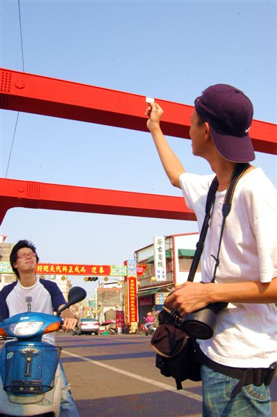

急急忙忙的趕回東港，就是為了王船祭阿！這次來的朋友有慶大、暘順、Znikang、Kyozi 還有一位高應大的朋友。  
  
不過由於有兩隻 Nikon D40 要來，所以我就只有意思意思的拍個幾張，也不放上來了。所以下面看到的照片都是從 Znikang 跟 kyozi 的相簿 A 來的啦，哈哈哈。  
  
我到家差不多十點，打電話給 Znikang 沒想到他們還在台中，所以就悠悠閒閒的上個網。接近十二點時，慶大一行人就到達我家了。因為家裏沒什麼好招待的，所以就請強者我老哥去買了臭死人不償命的臭豆腐，還有茶裏王來給舟車勞頓的朋友燻一下啦。  
  
Kyozi, Znikang 約一點四十餘分趕到我家，因為王船在兩點就要從東隆宮出發了，所以我們就火速前往東隆宮，接下來就是拍拍拍～擠擠擠～走散的走散～接下來走到海邊，就是靠體力的消磨戰，因為我們要在這邊待上幾個小時，讓所有的儀式完成，像是搬金紙阿、立桅啦、送神啦等等儀式，等到我們精神已經到達站著閉上眼睛都能入睡的極限後，終於燒啦！來張燒之前的照片：  
  
  
  
接下來就是熊熊的大火…。後來兩個死命拍照的實在站得太近，我就遠遠的等他們拍完啦。我只能說這種熱度真的相當難靠近。接下來，就天亮了。 囧  
  
後來回家之後，當然要吃個東港的特有小吃，肉粿啦。海鮮在其他地方還吃得到，不過肉粿可不是到處都吃得到的喔。如果有誰來東港，不要忘記來吃肉粿阿。  
  
然後當然就是先睡個一覺，起來剛好中午，吃完大餐之後，又帶他們去魚市場拍。  
  
  
  
接下來又去了鎮海公園拍餘燼、東隆宮跟黃金牌樓，下面那個蹲著的就是在下我啦，帥吧。  
  
  
  
然後途中還用 1 GB CF 卡救了 kyozi 一命  
  
  
  
然後就結束了～詳情請看 [kyozi](http://kyozi.blogspot.com/) 跟 [znikang](http://znikang.blogspot.com/) 的 blog。