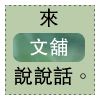

  
[凱文西格瑪](http://che-kevinsigma.blogspot.com/)正在舉辦一個[活動](http://che-kevinsigma.blogspot.com/2006/11/che-and-his-motorcycle_20.html)，我覺得相當的好玩，所以就也來試試看。  
  
不知道有多少朋友正在閱讀著 Yuren's 文舖呢？如果您很喜歡這邊的文字，現在有個機會也可以讓你在 Yuren's 文舖上說說話！  
  
簡單的說，就像交換日記一樣，你可以在文舖上發表一篇文章，如果你願意在 blog 上舉行相同的活動，我也會發表篇文章給您。  
  
方法也很簡單，只要先在這篇文章留個迴響，再將平常會在自己 blog 上發表的文章寄給我就行了，別忘了附上您的暱稱以及 blog 位址（不想公佈可不留 blog 位址），到時候發文章時會一起刊登。  
  
為了好玩起見，請不要提供發表過的文章，如果可以的話，希望在您的 blog 也不要發表重複的同一篇文章（我覺得這樣比較好玩），不過歡迎介紹這次的活動，歡迎舊雨新知來捧捧場！  
  
我的電子郵件是 yurenju (at) gmail . com，右邊的 about me 側欄也有我的電子郵件。  
  
參加名單

*   [凱文西格瑪](http://che-kevinsigma.blogspot.com/)
*   [chencha](http://www.wretch.cc/blog/chencha)
*   [黑碳](http://www.wretch.cc/blog/sheanye)
*   [Rach](http://rachmaninof.wordpress.com/)
*   尋
*   [Elsie](http://lightstarslin.blogspot.com/)  
    

註：參加來文舖說說話的朋友，要刊登的文章不用急，慢慢寫就好 :P  
  
十一月二十三日加註  
因為玩的人已經有點多了，所以再一個名額就不接受報名。之前報名的朋友慢慢寫就好了，別急別急 :-)