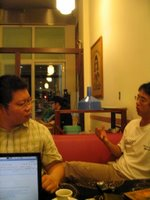
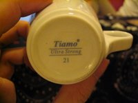
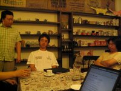

參加完 [KaLUG 11 月份聚會](http://yurinfore.blogspot.com/2006/11/2006-kalug-11.html)後，一夥人跑去海南涮羊肉吃飯，又跑去大魯閣打擊場，最後終於到今天的最後一站，橘園咖啡館。  
  
橘園在高雄算相當的有名，其實聖米目前的 espresso 也是採用橘園的豆子。橘園的老闆是 apple，在[貝拉討論區](http://www.bellataiwan.com/phpBB2/index.php)相當的活躍。  
  
我跟黃大哥理所當然的都點了 espresso，而其他人則點了冰卡布其諾、冰焦糖瑪奇亞朵。冰卡布上來的時候著實讓我有些驚訝，因為他們的冰卡布其諾賣像並不好，讓我覺得老闆對冰咖啡有一定程度的輕視（笑），當然這只是我的猜測，或許這樣預先混合會他們認為比較好也說不定。最後兩杯上來的是我們的 espresso。  
  
先看一下杯子，是硬瓷杯，外表看不出廠牌。入喉之後…，唔，是中規中矩的 espresso，不差，但是並沒有感受的什麼特色，適當的萃取量、適當的香味，沒有尾端苦澀味道，但也沒有特色。不過很久沒喝到 espresso，這樣一杯中規中矩的 espresso 也是讓我感到相當舒服。喝完之後習慣性的看一下杯底，是 Tiamo 的杯子。  
  
中間有段時間我跟黃大哥到外面拿 Notebook，就開始討論冰咖啡跟 espresso 的問題，兩人所見略同。  
  
  
接下來我們一邊延伸著下午在 mocamona 咖啡館的討論，一邊聊著一堆離不開電腦太多的話題。snowwolf 還跟我說了 IBM 基於 eclipse 創造的 IDE, WebSphere，比起 eclipse 還要大的怪獸，倒是讓我有些把玩的興致。不過聽到他 1.5 GB 的記憶體還很慢，就打消念頭了。  
  
最後終於要走了，老闆問黃大哥咖啡如何？黃大哥要我發表意見。我就把我的感覺說給老闆聽了。或許是期待太高，所以覺得咖啡並沒有想像中的好喝、豐富。  
  
『那你想要喝什麼樣的咖啡？』好問題。  
  
『我想喝再酸一點的』  
  
『那要不要再試試？』老闆上訴，當然就接招了。  
  
老闆拿出了另一包豆子，使用 88 度的沖煮水溫，敲粉，填壓，最後煮出來之後，用湯匙試味道，真是細心。光聞味道就知道這杯一定酸的了。入喉，果然正阿。抖擻的酸味讓我想起許久以前在 Pianopiano 喝的 LAVAZZA Gold Selection，而濃稠的口感、香氣，更是有過之無不及。問老闆 Robusta 咖啡豆的比例？答案是零。真愉快的答案 :-)  
  
接下來老闆又沖了一杯 92 度的，當老闆端咖啡給我的時候，我還正想著是不是要跟他要杯水，老闆就端給我了，真的是很細心…。這杯的香味真讓我一聞就泛起邪惡的笑。雖然不清楚味道如何，總是覺得有什麼驚喜。入喉後先一陣酸味，接著就被滿嘴的甜味蓋過，真是極品阿。  
  
總結，雖然第一杯 espreeso 給的感覺有點平凡，不過後來的兩杯真的是相當好的 espresso，推薦愛喝 espresso 的可以到橘園試試，晚點我會補上地址。  
  
另外他的機器驚訝指數也蠻高的，小小的機器上有三個數位儀表，一個類比儀表，後面還拖了一個幫浦在後面…，來的話一定得見識見識這台機器。  
  
地址：高雄市三民區明誠一路 306 號