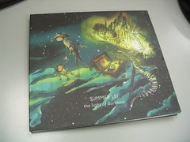

  
  
剛聽一輪時，覺得這些歌聽起來很舒服。特別是《New Dreams》這首歌，大量的音樂僅配上少許的口白，很特別。因為這首歌對歌詞起了興趣，便去歌詞版找個歌詞。看了歌詞後真是讓我傻了眼，實在是寫的太好了，再重溫幾次，沒想到愈聽愈是愛上了雷光夏啊！  
  
下面附上了造字的人，我非常的喜歡。除了動人的音樂外（他的音樂讓我想起了 Yann Tiersen 跟王雁盟），歌詞表達的意境，真是帶給我很大的衝擊。  
  

>   
> 造字的人 詞曲唱: 雷光夏  
>   
> 是黃昏的漸暗的太陽  
> 是難再被描述的時光  
> 是夜晚與清晨的激盪  
> 世界 以沈沒在喧嚷  
>   
> (「我畫著，歲月自手邊流逝，  
> 你們和他們，終將成為彼此的影子」)  
>   
> 是潦草被寫下的誓言  
> 是年少時拂面的春光  
> 音樂搖晃 語言正退讓  
> 你說 一切永不再來  
>   
> 是夜晚與清晨的激盪  
> 是難再被描寫的時光  
> 是黃昏的漸暗的太陽  

  
  
每每自己一個人聽這首歌，聽到中間的那句旁白，都讓我鼻子一酸。  
  
\[update\] 買了 :-)