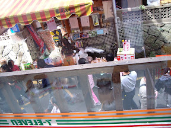

從嘉義市到奮起湖距離很短，還不到一個小時，我們就到了阿里山山腳的小七。再上去的路總算是有跑山路的感覺，一直蜿蜒到奮起湖。上山的感覺很微妙，從平地上眾多的車潮，山腰開始出現林立的檳榔樹，再上去一些又逐漸的消失，取而代之的是像羽毛一般葉子的蕨類，一直到接近奮起湖時，開始出現筆直的針葉木。  
  
路上的風很清爽。當海拔逐漸提昇時，心情也愈開闊。看著淡藍色的遠山，逐漸消失的常見檳榔樹，好像自己也可以被這個嘈雜的世界暫時忘記一般。約一個小時的路程之後我們在路上小作休息，旁邊剛好還有一窩小狗，很可愛。  

[超可愛的小狗](http://picasaweb.google.com/yurenju/TravelOfFencihu)

  
不久之後，我們在石棹轉進169縣道就到達了即將要待兩天的地方 - 奮起湖。跟我記憶中的地方幾乎沒有變化，還是一樣的美麗。從不冷漠的老街，雲霧飄進的車站，沿途都是叫賣的鐵路便當。  
  
是啊，奮起湖，我回來了。  

[熙攘的老街](http://picasaweb.google.com/yurenju/TravelOfFencihu)

  
下一篇：[奮起湖之旅 - 愛玉伯ㄟ厝](http://yurenju.blogspot.com/2006/12/blog-post_8628.html)