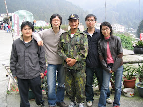

鋸角雪螢，這是我們來奮起湖三大目的之一。  
  
大多螢火蟲都是夏天繁殖，而鋸角雪螢則是在冬天。鋸角雪螢跟其他螢火蟲不一樣的還有牠的螢光不會一閃一滅，而是持續的發亮。而奮起湖就是觀賞冬螢相當好的地方。  
  
當天去住宿時，老闆（也是村長）跟我們說晚上七點會有導覽員可以帶我們去看冬螢。  
  
晚上吃飽飯後，我們就跟著導覽員到百年土地公廟再過去的觀螢區。但是很可惜今天的螢火蟲數量並不多。同時頂多四、五隻在空中飛舞。不過看到這種不會熄滅的螢火蟲也值得囉。  
  
當大家都散去後，我們幾個還在觀螢區，看看可不可以再看到多一點螢火蟲。突然，我發現還有一個人沒走。而且讓我有點警戒的是他穿軍裝…。後來跟他聊過之後，才知道他原來是在老街底賣咖啡的那個軍人（其實他只是穿軍裝，並不是軍人）。除了帶我們繼續深入到火車隧道那邊看螢火蟲，一路聊下來，才很巧的發現他也是很熱愛咖啡的朋友！  
  
所以呀，喝咖啡，到奮起湖都不寂寞。  
  
最後一天的最後一個行程，就是到他的『[孔咖啡](http://tw.myblog.yahoo.com/jw!sY5t9aWQGRRpi40bPc2yv0Uzgvst/)』喝咖啡。因為他自己烘培，並且採用的是深烘培的豆子，所以我不太習慣這種口味。不過可以感覺的出來他是一位很熱愛咖啡的朋友。順便跟他請教的高山煮咖啡的差別，溫度要比平常高，記起來了…。  
  
\[update\]  
延伸閱讀：[孔咖啡探索奮起湖步道之部落格 - 嘉義大學資工所同學奮起湖合影](http://tw.myblog.yahoo.com/kong-cafe/article?mid=1000&prev=1002&next=990&l=a&fid=9)  
  

  

下一篇：[奮起湖之旅 - 大凍山日出](http://yurenju.blogspot.com/2006/12/blog-post_9124.html)