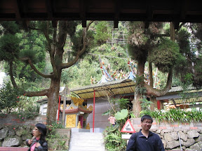

[貝克宅 / 鹹蛋超宅](http://picasaweb.google.com/yurenju/TravelOfFencihu)

  
  
睡～醒～了～。  
  
聽說晚上大家都沒睡好，樓上的大概在玩枕頭大戰吧，在三點多大家還不約而同的全部都起床了。不過裡面睡得最甜的就是我，我向來是倒地就睡的。稍作整理後，一行人到小七買個熱飲就出發，結果走到一半才發現沒有帶手電筒又回去拿，耗掉不少時間。還好中途沒有迷路就到了大凍山登山口。  
  
其實我蠻緊張的。因為天色已經微微的發亮，我已經下定決心要看到日出，沒有看到真的是會飲恨。所以我們用蠻快的速度不斷往上爬。到了一半，天空竟然泛起紅色的朝霞，讓我整個神經都繃的緊緊的，又繼續加快速度往前走，一路上不斷的超越其他隊伍。後來宅哥跟阿佩跟不上，我跟小朋友就先走在前面。  
  
老實說，走到後來根本就是用意志力在行走。  
  
早就已經氣喘如牛，雙腳不停的顫抖，我們中間在爬一個階梯時，我跟小朋友還同時停下來，因為就連跨出一步都很困難（笑）。但沒有完成到奮起湖的三大目的，我怎麼能甘心的離開這個美麗的地方呢？所以稍作休息後，我們還是繼續的往前行。在路上我看到一個指示牌：  
  
『大凍山觀景坪，300m / 15 分鐘』  
  
我真的超級傻眼，腳都快斷了，日出也蓄勢待發，還要走十五分鐘，真是嚇得我 屁滾尿流 不知所措。不過為了幫隊友打打氣，我就跟他說：  
  
『ㄟ，小朋友，只剩三百公尺了，衝阿～～～』  
  
當我到最後已經走到快喪失信心時，我突然聽到稀疏的人聲…。我興奮的大叫，『小朋友！到啦到啦！』聽說稍慢的宅哥也聽到我大叫了（笑）。最後我踏著步履維艱的雙腳，走上大凍山觀景坪。  
  
看到還沒出來的太陽公公，還有壯麗的雲海，一切都值得了。那種辛苦過後，看到開闊天空與雲海的感受，我想只有 KI 進香團的各位，真正的自己站在觀景坪才能體會。  
  
我們終究是完成三大目標，鐵路便當、冬螢跟大凍山日出。很開心，真的是玩的超開心的，雖然有點累（笑）。  
  

[枯枝與藍色天空](http://picasaweb.google.com/yurenju/TravelOfFencihu)

  
  

[大凍山日出](http://picasaweb.google.com/yurenju/TravelOfFencihu)

  
  

[雲海](http://picasaweb.google.com/yurenju/TravelOfFencihu)

  
  

[海拔 1976 的 KI 進香團](http://picasaweb.google.com/yurenju/TravelOfFencihu)

  
  
在離開的最後，我們又去百年土地公廟補拍照片。下面這張我覺得照得很像電影劇照 XD  
  

[阿宅小朋友之電影劇照](http://picasaweb.google.com/yurenju/TravelOfFencihu)

  
  
奮起湖之旅我玩的很開心，大家也可以去奮起湖走走。會很開心的！精選再精選的相片在 [Picasa 網路相簿 - 奮起湖之旅](http://picasaweb.google.com/yurenju/TravelOfFencihu) 裡面，因為我們拍了六百多張，放上來就得看我的相簿爆炸了。  
  
最後，謝謝大家的收看！