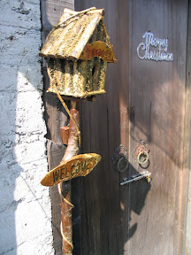
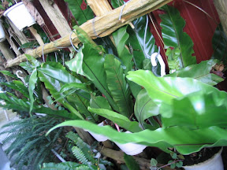
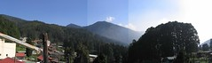
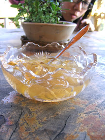
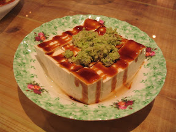
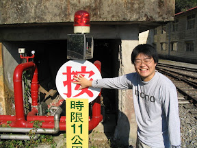

因為 check in 時間還沒到，所以我們把行李暫時放在民宿，就先出去吃來奮起湖一定要吃的奮起湖便當。尋著網路上的指引，我們去『阿良的鐵路邊當』吃。雖然說不難吃，但也沒什麼特別的。出來之後，又到了旁邊的『愛玉伯ㄟ厝』。  
  
這間店算是隱密的恰到好處，一個奮起湖的小巷，牆壁上寫著粗糙的指示。依循前進，又發現了另一個精緻的指示，寫著『愛玉伯在樓上』。  
  

[一樓的小招牌](http://picasaweb.google.com/yurenju/TravelOfFencihu)

  
我對這種小店一直存有好感。上去二樓的樓梯，就好像走進一間用了許多心思的小咖啡館一樣，兩旁擺滿了綠色的盆栽，柵欄旁的盆栽垂滿了鬍鬚，在微冷的風中輕輕搖盪。這盆綠油油的山蘇，在海拔一千四餘公尺的小鎮上，更顯得翠綠光亮。  
  

[山蘇](http://picasaweb.google.com/yurenju/TravelOfFencihu)

  
上去看到的景色更是讓我傻眼。愛玉伯ㄟ厝是半開放式的店面，二樓外面，就是那種淡藍色的山景，幾片雲浮在山上，配上奮起湖的空氣…。  
  
  
  
大家都點了特調愛玉，是在愛玉裡面加了百香果，酸酸甜甜的口味。不知道是景色太漂亮，還是高山泉水總有甜美之處，愛玉伯的愛玉還真不賴，可惜沒有看到愛玉伯。  
  

[愛玉伯ㄟ愛玉](http://picasaweb.google.com/yurenju/TravelOfFencihu)

  
  
臨走前，愛玉伯ㄟ媳婦（還是女兒？還是服務生？）跟我們推薦了老街上賣豆花跟豆腐的店，說用高山泉水做出來的豆腐是一絕，務必要去品嚐。所以 KI 進香團又前往了老街，來來回回的找了很久，終於在眾人眼殘+腦殘的搜尋後，找到這間豆腐店。這間豆腐店…  
  
豆花，好吃！  
豆渣餅，好吃！  
現磨山葵豆腐，超好吃！  
  

[現磨山葵豆腐](http://picasaweb.google.com/yurenju/TravelOfFencihu)

  
愛玉伯ㄟ媳婦（還是女兒，服務生，不管啦。）果然中肯，真的很好吃。  
  
其實我們中間還有去到處走走，研究一下奮起湖的各種裝置，順便為大家示範正確的用法。  
  

[這個應該是這樣用的吧？](http://picasaweb.google.com/yurenju/TravelOfFencihu)

下一篇：[奮起湖之旅 - 冬螢與咖啡](http://yurenju.blogspot.com/2006/12/blog-post_1873.html)