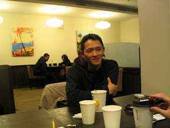
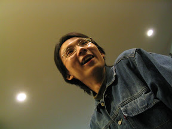
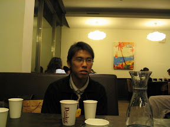
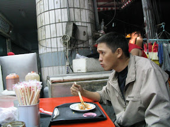
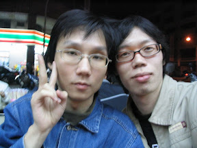
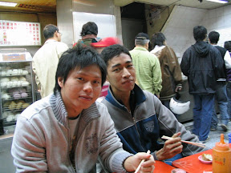

原本沒打算出去。後來大頭問我跨年要去哪，才知道小包、十億全、無力他們都在高雄。所以又MSN問了小包，才敲定跨年那天晚上要一起吃飯。  
  
先去明誠路上的和光廚房吃飯，好吃！（不好意思，我太好養了什麼都好吃）  
  
    
  
後來就到星光碼頭這邊跟高雄市的 鄉民 市民一起人擠人。後來原本沒來吃飯的尋先生也來了。跟他聊了很多，關於一些自己的看法啦，還有一些興趣方面的，講了很多我覺得blog好玩的事情。不過這當然是僅供參考，每個人怎麼過生活、怎麼認識朋友，怎麼找尋生活意義的方式都不一樣。對於別人，我也只能提供一種我自己走過，而且覺得很好玩的路。  
  
別人適不適合這麼過生活，就不一定了。  
  
最後跨年的時候，趕快點起了一根煙，從2006年抽到2007年，萬歲！呵呵，今天來的目的之一，就是抽跨年菸啦，哈哈。後來又跑去吃很久沒有吃的九九豆漿大王，吃完又去逛了很久沒去的高應大校園，進去又跑到406實驗室…果然沒人。  
  
    
  
雖然高雄的跨年實在有點鳥，但是有朋友相陪，今年跨年也是蠻歡樂的。順便謝謝各位朋友用簡訊轟炸，你們的祝福我確實的收到囉。  
  
其他的照片在 [picasa 相簿](http://picasaweb.google.com/yurenju/20062007)