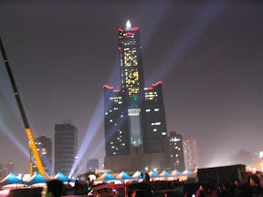

『沒有收到耶。』  
  
加了一些運氣成份的限時信沒有送達，有點驚訝，也有點小小的失望。或許是太相信郵差了吧。 掛斷後，點了一根 Sunday's Fantasy，稍微遠離不抽煙的朋友們，到人群稀疏的廣場，看著有 Johnnie Walker 鐳射光標誌的 85 大樓。  
  
  
  
是啊，抽根菸就像是一個儀式般，總是在發生特別的事情時點燃。或許就像是以前覺得的那樣，可以燃燒些壓抑的情緒，一些鬱悶。但問我真正的原因，卻還是答不上來。  
  
或許就像是那天離別的時候，招招手，接著紅色的車尾燈慢慢隱晦在午夜無人的大街上。我站在空無一人的停車場，抽著早已點燃的菸。慢慢的，那些心裡腦裡想的雜亂思緒就像被肺泡吸收一樣，也變成了徐緩的煙霧。  
  
最後，從我敲打的文字中，慵懶的、輕慢的，流露。