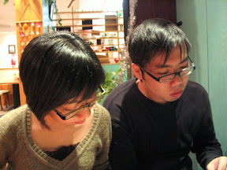
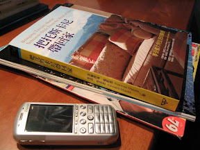
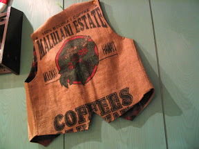
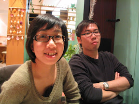
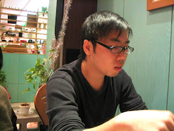

  
是誰提議期末考週要去喝咖啡的？  
  
不管是誰提的。今天下午我們不在咖啡館，就在往咖啡館的路上。路程中的夕陽非常的漂亮，一朵朵的雲淺淺的疊在一起，白淨無暇的雲飄在高空，而靠近太陽的邊緣部份，則鑲上半圈金黃。從宿舍來的路上，我就一直抬頭看著這片美麗的夕陽。可惜相機放在小朋友的包包裡就沒拿出來拍了。  
  
今天去的咖啡館是卡布里咖啡館，是我覺得嘉義市內還算不錯的咖啡館，而且餐點還蠻好吃的。我們點了安吉拉雞肉卷（我）、安吉拉雞肉卷（宅）跟貝果（小），咖啡則是卡布奇諾、摩卡奇諾、摩卡奇諾。  
  
餐點好吃。我在這邊吃過了墨西哥…什麼卷的忘了、安吉拉雞肉卷、貝果、德國香腸，都很好吃。咖啡嘛，稍微淡了點，但是還是有一定的水準。不過一直提不起勁喝這邊的 espresso。  
  
今天把《把托斯卡尼帶回家》帶去看。我真的很羨慕作者在義大利過的生活，感受義大利的熱情、溫暖的陽光、跟隨性的處事態度。而且他們會幫自己的房子取名字耶，感覺起來在自己住的這間房子，放了很多感情進去。  
  
總之，過了一個悠閒又有罪惡感的午後，感覺不賴。  
  
    