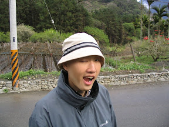
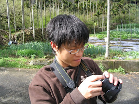
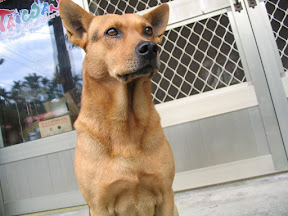
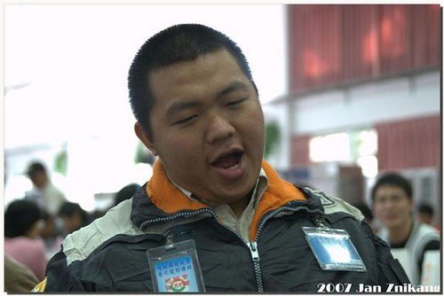
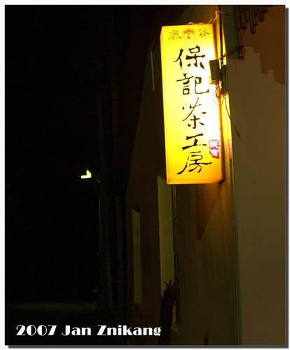
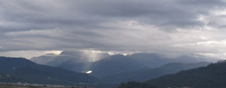
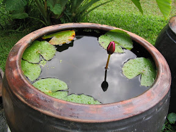
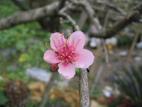
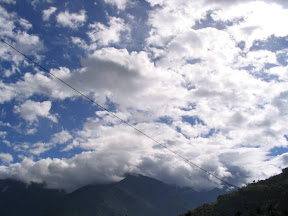

緊接著期末考結束，這個週末跟 [kyozi](http://kyozi.blogspot.com/), [znikang](http://znikang.blogspot.com/) 還有中途加入的[小白](http://www.wretch.cc/blog/tortaredeath)一起到台中看 OD，接著到南投玩。這次的重點行程就是到成功嶺看 OD，還有風櫃斗梅花。  
  
     
  
OD 實在沒什麼變化。上次進去受訓被七天內驗退後就已經理光頭，現在看到他也沒比較瘦。不過那麼多人來看他感覺起來還蠻愉快的啦。而翔也在，原本以為他也是來看 OD 的，沒想到翔竟然是也來當兵的…，兩個加起來親友團超大一群的呢，十五個人左右。  
  
  
  
後來我們先到高鐵烏日站看看有啥特別的，不過實在沒什麼。結束後直接到南投鹿谷的民宿[保記茶工房](http://paoji.mmmtravel.com.tw/)，這間是我爸的朋友開的。環境還不賴，距離日月潭、集集還蠻近的，距離風櫃斗約一個小時車程。  
  
  
  
後來晚上去集集隨便逛逛，接著再跑去 znikang 跟 kyozi 之前去合歡山的時候中間休息的 February coffee 坐一下，小白因為感冒已經很累，就在店內睡著，一直到我們要走才起床。回到民宿的時候也差不多十點多，不過東摸西摸的也到一點多才睡啦，哈。  
  
隔天早上就前往風櫃斗啦，花開的還蠻美的。那兩個人拿著相機拼命的拍，我跟小白就當個路人到處走走聊聊了。  
  
梅花勒？去 kyozi ([1](http://www.pixnet.net/album/kyozi/1367750), [2](http://www.pixnet.net/album/kyozi/1367740), [3](http://www.pixnet.net/album/kyozi/1367750)) 跟 [znikang](http://www.pixnet.net/album/znikang/1367015) 的相簿看看吧。這次去因為有兩隻大砲，我拍的就很少囉。不過這次去看到很多很漂亮的天空，倒是拍了不少。剩下的照片我放在 [picasa 相簿](http://picasaweb.google.com/yurenju/FongGueiDou)裡面。  
  
   