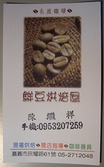
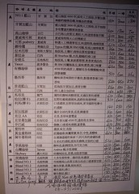

最近很喜歡下午出去閒晃的感覺。  
  
因為最近打算好好整治一下自己的牙齒，剛好預約牙醫的時間都在傍晚時分，就有了許些的理由，可以傍晚的時候出去晃晃。下午的陽光溫柔的沾染在身上，微風涼爽，偶爾帶些舒服的氣溫。洗完牙以後我從民權路轉啟明路的時候，異常乖乖的二段式左轉（這條路有夠小的阿，其實上次在民族路沒二段被抓包…），眼尖的我看到一間小小的店，外面招牌寫著咖啡什麼的。這麼悠閒的下午，邂逅了咖啡館，怎麼能不好好瞧瞧呢？所以我就繞到咖啡館前面，想仔細看一看，這才發現，原來是咖啡豆專賣店。  
  
而在外面烘豆的老闆正巧與在外面躡手躡腳的我對上眼，我就只好把機車停下來，進去看看。原來這邊是專賣咖啡豆的。跟老闆拿了一張 Menu，什麼～好多豆種阿，而且全部都可以現烘，可少量烘培、指定烘培度，不僅如此，如果自己烘的話還可以八折！  
  
  
  
這種有吃又有拿的好康，怎麼可以錯過！不過最近買的咖啡豆還沒喝完，所以這次就沒跟老闆買了。不過跟老闆小聊一下，他對烘豆真的很有心得，也很專業。這讓我這個完全沒有烘豆知識的人大大開了眼界，也學到蠻多東西的。  
  
所以，下次要去買豆子，順便學學怎麼烘豆啦…萬歲！  
  
而且老闆超妙的。他說，美洲的咖啡豆都像是公務員，都中規中矩的，炒的淺就酸，炒的深就有 body。但是～如果是火山岩地形的咖啡豆，就像蕩婦，風情萬種。  
  
恩，筆記筆記筆記…。  
  
地址：[嘉義市民權路61號](http://www.urmap.com/?link=Q6Q6dPaPY1mg1j-YRIm%2Bd5U2s0%2BQ1P-Yd0%2B3dYP2sI6%2Bdjag3I%2B3d3-gfI%2BQ1jUgR0lQdj-2OI%2BWlUUgRh%2BmYEY3Tf33LdELgmLEkL-YUL55d41YglW15E6fTm5alEYYa4Ls1sL6Rl6QdL-YO0Ps14-gY0%2BRdjaY3I%2Bs1IaYR0l2djPYY0P3d5-YR054dk-Y30P5d4UTQ0Psd)