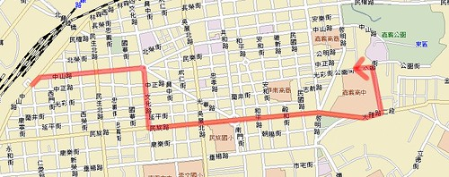

  
  
雖然有點誇張，不過我今天從火車站走到了公園路 141 號。  
  
因為之前回屏東的時候沒有把機車寄在火車站，所以這次回來嘉義就沒有機車可以騎回去。想想今晚又沒有什麼行程，索性就走路回嘉義大學。大約五點的時候從火車站出發，一路逛中山路、文化路上的唱片行、精品店，反正看到有趣的就停下來進去店內走走。到公園路 141 號的時候已經大約七點二十分了。  
  
但是有一件很可怕的事情，就是我沒有看到『早上七點鐘』。  
  
因為我是走到途中才想說順便過來找找看咖啡館，windmill 的文章寫的地址我有點忘記，只記得應該是嘉義中學後門，什麼路就忘記了。不過隨意嘛，沒找到頂多就去 [fun 輕鬆](http://yurenju.blogspot.com/2007/02/blog-post_1720.html) 坐坐而已。但是到目的地的時候，我真的沒有看到早上七點鐘這間咖啡館，眼前所及的只有一間叫做『悠咖啡』的咖啡館（這讓我想到虎尾鎮的蓁咖啡）。恩，老話一句，隨便嘛。從火車站走到這邊我已經累的要命了，只要一間咖啡館可以讓我坐著休息一下我都很樂意阿…。  
  
所以晚上七點鐘，我沒找到早上七點鐘，就在這間『悠咖啡』喝咖啡。