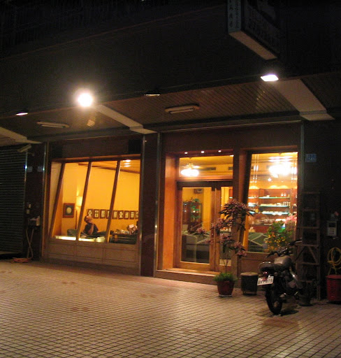
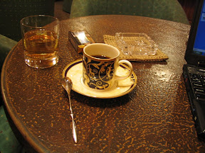
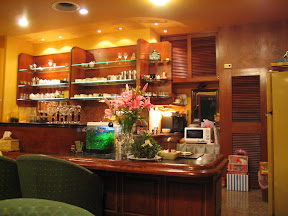
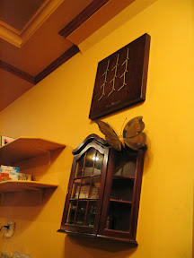
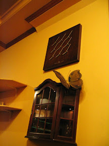
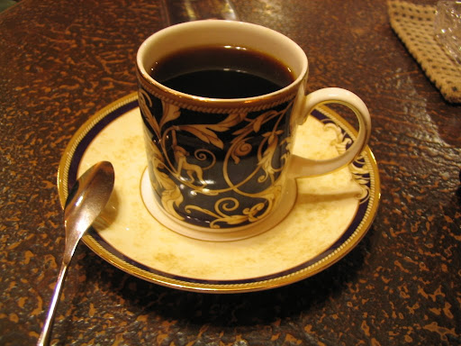

  
  
第一印象。  
  
窗明几淨的咖啡館，外頭是整片斜斜的落地窗，店裡的看起來都不是客人（包場耶，爽快！）。進來之後，接著服務生（應該是老闆娘吧？）親切的招呼。桌上擺了塊絨布，上面是煙灰缸，感謝上帝，這裡是可吸煙的咖啡館。全部的座位都是類似沙發的座椅，牆上擺了個很像時鐘的東西，不過我並不確定它是否會運轉。服務生給我一杯茶水，但我也喝不出這是什麼茶。總之第一印象很不錯。屬於比較明亮的咖啡館。  
  
     
  
看店內的擺設，這邊應該是以單品為主的咖啡館。Menu 上有藍山、巴西、曼特寧、哥倫比亞等。點了杯哥倫比亞。咖啡很符合大眾口味，這杯哥倫比亞有些像曼特寧，但又多了一點些微的酸、甜，還不賴。咖啡杯我也蠻喜歡的。特別是走了兩個多小時的路程後，這杯微燙的咖啡入口後，配上一根今天新嘗試的 Macbeth 菸，真是相當享受阿。  
  
  
  
旅途中，任何一些美麗的相遇，都會很容易敲動人心。  
  
後來我問了老闆一些問題。第一，這間咖啡館已經營業 18 年了！這是我去過的咖啡館中營業第二久的（最長的是斗六的[吾愛吾家](http://yurenju.blogspot.com/2005/05/blog-post_111617954006754091.html)）。第二，那是桂花茶。第三，我走錯方向了，早上七點鐘在這條街的另外一端（耍笨了）。  
  
感謝收看！