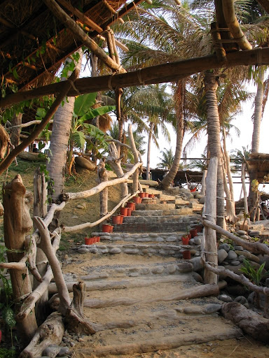
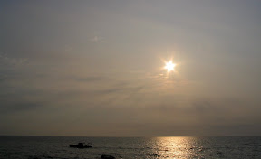
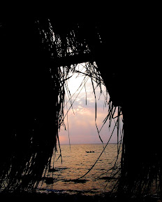
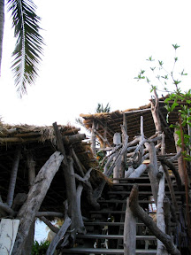
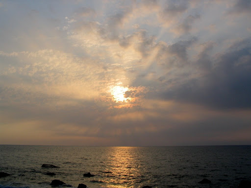

初三的時候，因為老是窩在東港也悶了。就到往墾丁路上的一間咖啡館喝咖啡，順便散散心。  
  
  
  
魔幻咖啡，充滿南洋風味的一間咖啡館。用茅草（是嗎…）與漂流木所搭成的，大約有五、六個茅草小屋。當走下階梯時，眼前的這片美景真讓我呆住了。雖然屏東下午的陽光還很炎熱，但是波光粼粼的海洋，海浪拍打著岸邊的聲音，再配上空氣中鹹鹹的海水味。我想任何人都會被這景色吸引住。海邊正好有人在跟紅貴賓嬉戲，配上背景那分成好幾層顏色的海洋，真的很棒、很悠閒。  
  
   
  
至於咖啡，還 OK。可惜今天客人太多杯子不夠，只好用外帶用的紙杯。平常不應該是這樣的。這邊的風景真的是很美，不管是誰都會愛上的。  
  
    
  
下次有到墾丁的路上，別忘了到這間咖啡館，坐下來享受一下南洋風情的咖啡館。  
  
更多照片在 [picasa 相簿](http://picasaweb.google.com/yurenju/MagicCoffee)  
地址：屏東縣枋山鄉南和路 99 號