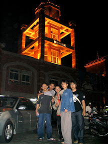
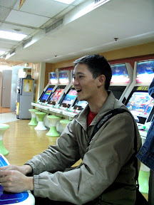
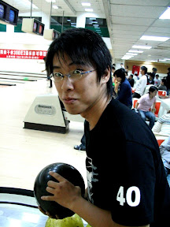
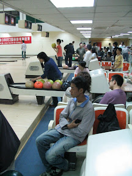
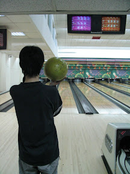
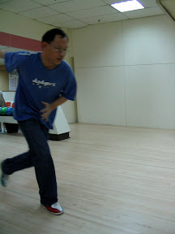

反正都寫了，就把有圖有真相的部份寫一寫。  
  
初四有兩個行程。中午要跟以前社團的朋友出去吃飯，而下午要跟五專的同班同學出去玩。這次社團聚會比我想像的人還要多。從第一屆董哥，到十幾屆的清風都來了。小馬、蚊子姐、小華學姊、小祥、小黑、佳慧、阿火等等來了超多人的。不過還是比上次的少一點就是了。不過很難得的小黑來了耶，幾乎沒有看他在 CCNA 的聚會出現過。吃了飯，後來又去董嫂的店去看董嫂。  
  
結束之後，又馬上衝到旗津。不過中間在過港隧道塞超久的，God，開車真不是件好主意。不過見到朋友還是很開心，尤其是小 Q 超久沒看到。後來我們在旗津那條很熱鬧的街到處吃，吃完之後又邀到十全路打保齡球。  
  
       
  
回到家已經十一點、十二點了，過完一整個充實的一天。