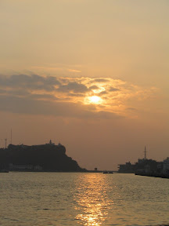
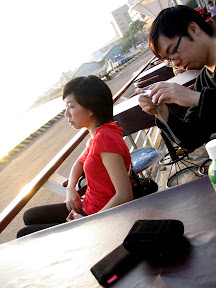
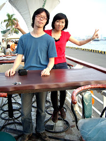
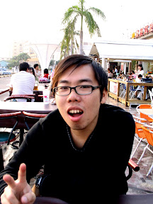
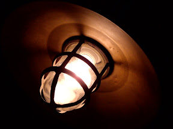
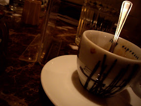
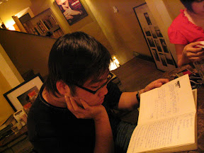
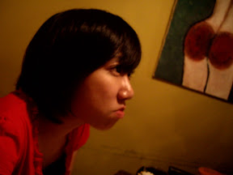

初六的事情。看起來我現在就是要把過年沒寫的份補齊就是了。 :-)  
  
邀了宅哥跟小朋友，在高雄市區亂逛。剛開始先到了渡船廠旁邊的漁人碼頭，不知道是不是高雄人的宅哥竟然還帶錯路了，嘖嘖。後來我們就在漁人碼頭前面的露天座位待許久，大致上嘛，就是講些完全沒營養的話題。  
  
     
  
晚點我們到愛河畔。還記得上次來的時候有遇到一個雙吉他的街頭表演，可惜這次去就沒有遇到了。那次真的覺得愛河畔這麼多街頭表演，還是那兩個年輕人的歌聲中，還帶有熱情。晚些再帶他們到 La Strada Cafe 吃飯，然後繼續聊著我們完全沒有營養的話題…，小朋友還笑到哭的一把鼻涕一把眼淚的勒。  
  
     
  
臨走之前再去小逛一下大統後面的小公園，跟他們介紹一下有那幾間可以來吃，最後到城市光廊去。可惜天色很暗，照片大多很糟。只有小朋友那張在 outdoor 前的照片好一點。  
  
照片都放在 [picasa 相簿](http://picasaweb.google.com/yurenju/jsCBRC)裏面。小朋友也寫了[一篇](http://chialin0323.blogspot.com/2007/02/la-strada-cafe.html)，裏面還有附一張[小朋友新年專用桌布](http://bp0.blogger.com/_phIu8YZg-bY/ReFHIB6pClI/AAAAAAAAAhU/RK3lD01v1Cc/s1600-h/chialin_wallpaper.jpg) XD