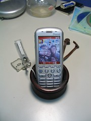

突然想到過年是不是應該期許自己今年有什麼表現。其實也沒啥好說的，今年跟往常有一點點的不同，所以許在心裡的願望當然也跟往年不一樣。總之，希望新的一年會是一個 A whole new world 了。這首歌是迪士尼 1992 年的動畫電影《[阿拉丁](http://www.imdb.com/title/tt0103639/)》的主題曲，一直覺得很好聽。  
  
  
  

> can show you the world  
> Shining, shimmering, splendid  
> Tell me, princess, now when did  
> You last let your heart decide?  
>   
> I can open your eyes  
> Take you wonder by wonder  
> Over, sideways and under  
> On a magic carpet ride  
>   
> A whole new world  
> A new fantastic point of view  
> No one to tell us no  
> Or where to go  
> Or say we're only dreaming  
>   
> A whole new world  
> A dazzling place I never knew  
> But when I'm way up here  
> It's crystal clear  
> That now I'm in a whole new world with you  
> Now I'm in a whole new world with you  
>   
> Unbelievable sights  
> Indescribable feeling  
> Soaring, tumbling, freewheeling  
> Through an endless diamond sky  
>   
> A whole new world  
> Don't you dare close your eyes  
> A hundred thousand things to see  
> Hold your breath - it gets better  
> I'm like a shooting star  
> I've come so far  
> I can't go back to where I used to be  
>   
> A whole new world  
> Every turn a surprise  
> With new horizons to pursue  
> Every moment red-letter  
> I'll chase them anywhere  
> There's time to spare  
> Let me share this whole new world with you  
>   
> A whole new world  
> That's where we'll be  
> A thrilling chase  
> A wondrous place  
> For you and me

  
  
不知道我有沒有提過？我的手機從原本的 Sagem X-5m 換成 Dopod 586w 了。希望自己也可以像換手機一樣，備足更多的能力、知識，來體會與面對我往後豐富的人生（糟糕，這段話真老套）。  
  
