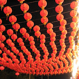

這次剛好台灣燈會就在隔壁的太保市舉行，就跟研究室的朋友一起去。不過除了一些比較特別的花燈以外，其他都沒什麼特別的，甚至我還看到在以前的燈會出現過的花燈。不過煙火就非常的漂亮，還記得跨年的時候跟五專同學在高雄 85 大樓附近的煙火鳥的要命，這次看到台灣燈會的煙火終於有值回票價的感覺。找了 Youtube 上比較完整的一段，不過跟現場的還是差蠻多的，現場的真的非常震撼。  
  
  
  
後來走了會場一圈，花燈倒是還好，不過花一晚的時間散散步也是很 OK 的啦。  
  

[

2007 台灣燈會

](http://picasaweb.google.com/yurenju/2007)