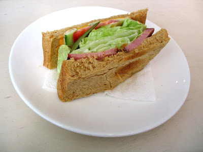
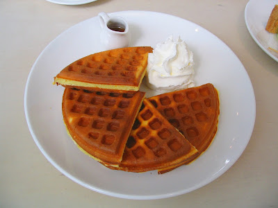

二二八。  
  
在這個值得紀念和平的日子，我決定到早上七點鐘坐坐。大概是名字的關係，總覺的這間咖啡館應該會在早上的時候來最有特色，所以就很努力的早起、漱洗，穿過大雅路旁的小徑，來到上次沒有找到的早上七點鐘。  
  
在這裡先預告一下，因為店內人很多，所以我就很害羞的沒有照店內，只有幾張食物跟咖啡的照片。  
  
早上七點鐘很明亮。在店前放了一個很大很大的 "7"，外頭擺了幾張桌椅，整片的落地窗裏面則是白色調的裝潢，黑色調的吧台。裡頭坐了幾桌客人，其中有一桌還是外國人。之前去卡布里也有外國人，看起來嘉義市內外國人還真不少呢。  
  
坐下沒多久，服務生幫我們送上套餐的 Menu。湯、主菜、飲料，對於一份早餐來說這實在蠻豐盛的。不過挾著今天是二二八和平紀念日，想來我跟我的荷包也可以很和平的度過今天。而且假日早上起來，吃一頓豐盛的早餐感覺真的很悠閒。  
  
湯是蔬菜湯，看起來應該是用番茄作底，主菜是鬆餅跟三明治，都還不錯。  
  
   
  
至於咖啡。我點了 Cappuccino，感覺起來這邊牛奶的比例放的比較少，使用偏苦的咖啡，所以喝起來味道十足阿！而且這邊的咖啡還蠻便宜的(NT. 45)，相較起來還真是超值阿。  
  
  
  
後來又到了對面超級大的嘉義公園走走，非常悠閒地度過二二八和平紀念日。