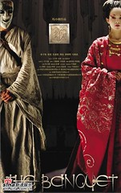

  
聽了這麼久的原聲帶，這兩天終於把《夜宴》看過了。雖然說這部片應該算是武打大作，但藏在華麗武打背後的，則是宮庭中糾纏的愛情故事。我很欣賞婉后、無鸞各自在對於親情、愛情交錯的心裡戲，又特別是每個人內心都有執著的一面。  
  
其中有段對話我很欣賞。婉后說：『那你從我的臉上能看出什麼來？』的時機很巧妙。我覺得很好看，喜歡中國古裝劇如《英雄》、《十面埋伏》的可以再看看《夜宴》，不錯。  
  

> 婉后：為什麼你表演的時後要帶面具？  
>   
> 無鸞：戴面具的表演是最高境界的表演，不戴面具，喜、怒、哀、樂，簡單地寫在演員臉上。戴上面具，偉大的藝術家能夠讓人在沒有生命的面具上，感覺到最複雜，最隱密的情感。  
>   
> 婉后：那你從我的臉上能看出什麼來？  
>   
> 無鸞：六分得意，三分緊張，還有一分對先帝的愧疚。  
>   
> 婉后：你錯了，是失望，對你的失望。我現在已不奢望靠你來實現我的夢想。只求上天垂憐，讓你我平平安安。你連最笨拙的表演都不會。你將你的悲傷、仇、恨、不甘、疑問和徬徨，通通寫在你的臉上，你讓殺身之禍如影相隨。說什麼帶著面具的表演是最高境界的表演，最高境界的表演，是將自己的臉，變成面具！