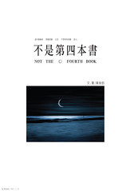

  
今天要睡覺前，第一次翻開《[不是第四本書](http://www.anobii.com/books/015447fffd3e6a2ad6/)》，才發現這本書的性質跟《[這本書](http://www.anobii.com/books/00954231a94fdc1e27/)》不太一樣。《這本書》大多用幾張連環的圖畫配上幾句文字，而《不是第四本書》則用一張圖畫，配上相對於《這本書》比較多的文字。  
  
頁面旁邊通常繪有一只咖啡杯，下面註釋一些文字。而這些短短的文字，卻反倒能點出我心中的感受。  

> 「我擁有過什麼呢」這樣的問題  
> 最快樂的人不會全部知道，最悲傷的人也不會全部知道  
> 翻閱記憶也不會全部知道，記憶力很好也不會全部知道  
>   
> 只能在生活裡慢慢一點點的失去，慢慢一點點的知道。

犀利。  
  
今天回到宿舍後，點了根菸，隨手翻閱《不是第四本書》，而後開了夜燈，在床上敲打著鍵盤，總結一下今日，斟上一小杯野牛草伏特加助眠。奇怪，我為什麼那麼悠閒…。