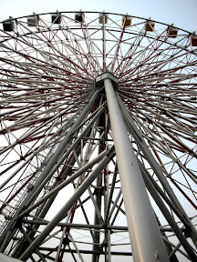
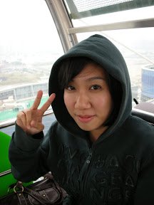
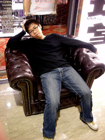
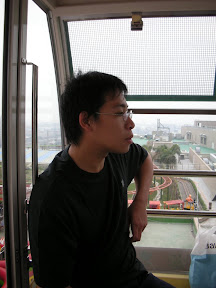
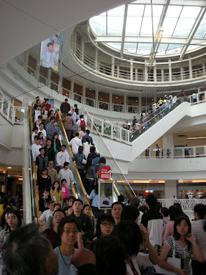
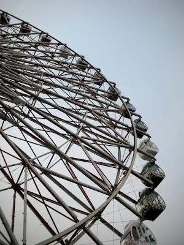
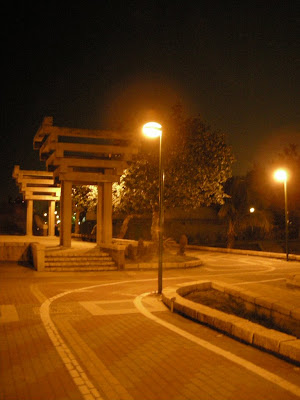

     
  
明明知道很多人，但是今天還是去夢時代跟全高雄市的鄉民們人擠人了。成員：我、小朋友、阿宅、馬克。這幾天夢時代剛開幕，從嘉義回來之前，馬克就在實驗室邀看有沒有人要一起去，所以今天大夥就一起搭我的車到夢時代。  
  
不過就跟預料中的一樣，全部都是人！  
  
  
  
還好這邊夠大，裡面有很多很多的獨立式的店家，如果算現在已經開幕的，我們應該已經逛完一半了，但是非常累阿，太大了。逛到腿軟就算了，沒想到想吃個東西至少都要排一個小時以上，誠心建議要來的人開幕期間千萬不要在夢時代裡面吃飯。  
  
沒想到隨便買個東西果腹後還沒學到教訓，我們打算要搭摩天輪，雖然知道很多人了。  
  
  
  
我們大概排了一個小時的隊才排到摩天輪，不過上面風景的確不錯。下去後我們跑去麥當勞吃飯後，又跑到旗津閒晃，吃了烤小卷，小逛一下夜晚的旗津才打道回府。  
  
  
  
剩下的都放在 [picasa 相簿](http://picasaweb.google.com/yurenju/DreamMall)。