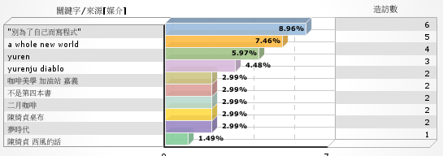

這幾天閱讀黑碳的《[發文與否?!](http://www.wretch.cc/blog/sheanye&article_id=17205552)》、《[\[續篇\]發文與否?!](http://www.wretch.cc/blog/sheanye&article_id=17219730)》與 Taiten987 的《[別為了自己而寫程式](http://taiten987.blogspot.com/2007/04/blog-post_8903.html)》（PTT share 版 18337 篇），正巧都是探討作某件事情的意義。  
  
看到這類的文章通常都會反過來思考自己到底為什麼這麼作。發文的動機比較複雜，以前我喜歡這種單方面的傾訴。因為會擔心跟朋友講某些話題很詭異，所以丟到茫茫網路上，喜歡的人就閱讀，不喜歡的也可以很輕鬆的避免。而且網路有股莫名的距離感，讓我比較吐得出象牙。現在的我還蠻喜歡互動的，不管是現實生活或者是網路上。而我也蠻喜歡分享技術類的資訊，所以有了 [Yuren's Info Area](http://yurinfore.blogspot.com/)。如果前面的理由是我為什麼發文的三分之二，而剩下的三分之一，大概就是出自於習慣。好幾年都做同樣的事情，突然停下來也很奇怪。  
  
至於迴響，我是抱持著有會很開心，沒有也無所謂的心態。就跟我不見東西一樣。拼命的想找就是找不到，擺爛不理他一下子就會跑出來了。而且迴響這件事情，一天二、三十個人來，但真正會回應的其實很少，所以阿，不要理它就好啦。  
  
所以你只要跟強尼沃克一樣，Keep Walking 就對啦。  
  
至於 Taiten 的《別為了自己而寫程式》。最近真的很久沒有寫程式了。覺得自己正在退化。人真的是種很犯賤的動物，有得寫的時候就覺得工作累得要命，沒得寫就會開始懷念了。  
  
哎呀，我突然想起以前在街角買杯卡布其諾，在往公司的路上一邊喝一邊想著該死的客戶管理軟體的日子。  
  
\[update\]  
恩，我 update 了。補充一下 Taiten987 這篇文章的最初文章來源就是 ptt share 版跟他自己的 blog。我幹嘛解釋勒？因為有從 Google 來的朋友似乎對這篇文章很有興趣呢！嘿嘿嘿。  
  
