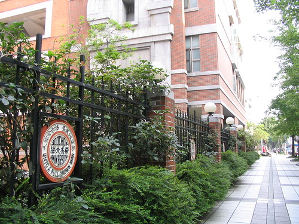
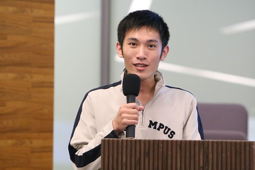

因為 [OSDC](http://osdc.tw/) 在早上九點舉辦，客運又沒有太晚的夜車可以搭乘。所以，凌晨一點，我到了嘉義火車站，搭上了三十二次往台北的莒光號列車。在一個印象中充滿迅速流動人群的都市裡，早上六點鐘的台北車站顯得空曠，從月台往車站長長的通道上燈光有些昏暗，不怎麼明亮的光線，與墊著厚紙板睡在火車站的人們，跟記憶中的明亮、熱鬧台北市重疊起來，畫面變得混亂。吃了早餐，在台北車站附近閒晃到七點後，就坐捷運到西門站，先碰碰運氣看有沒有菸攤晚上睡不著，提早出來賣菸（當然是沒有！），在空曠的西門町逛夠後，就走路打算到會場去。  

結果迷路了。  

跑到了這個地方…。後來打電話問[小祥](http://blog.360.yahoo.com/blog-PjbKFpMic6eL7XntfTr22ug-?cq=1)才知道原來就在延平南路上，一整個走錯。剛進來的時候，就看到很久不見的 Mat，上次見到是在高雄的 KaLUG 聚會，還記得那個時候看他的 Console 輸入法，很炫。  

  
由 [plasmaball](http://flickr.com/people/plasmaball/ "plasmaball") 拍攝

過了不久後，小祥、[Adrian](http://wshlab2.ee.kuas.edu.tw/personal/adrian/)、[jserv](http://blog.linux.org.tw/%7Ejserv/)、lightwind 等人陸陸續續的出現，而且還有幾個虎尾的學弟也有來聽。至於 OSDC 講什麼留到 [Yuren's Info Area](http://yurinfore.blogspot.com/) 聊吧。 OSDC 結束後，就跟 jserv, jesse 一起走到古亭站附近的 Mix Cafe 吃飯。這邊發生了幾個插曲。我要跟 [jesse](http://people.debian.org.tw/%7Ejesse/blog/) 自我介紹的時候，他竟然知道我就是 Yuren，還知道我有兩個 blog！  

恩，我有點訝異。後來吃飯的時候又認識在 X31 上 tune BSD tune 的很仔細的 [psilotum](http://nudum-cafe.blogspot.com/)（他拿了一台 Nikon 的底片機，過片的聲音讓我注意到他），一樣我要自我介紹的時候，他竟然也知道我是 Yuren…。呃…，有點詭異，看流量應該蠻少人閱讀 Yuren's 文舖跟 Info Area 才對，沒想到剛好都遇到有閱讀的人。  

七點半後，到南京東路捷運站附近的 Le Park Cafe 找 [Kyozi](http://kyozi.blogspot.com/ "Kyozi"), [Znikang](http://znikang.blogspot.com/ "Znikang") 跟 [Taiten](http://taiten987.blogspot.com/ "Taiten") 吃飯喝咖啡，在 menu 上看到一個詭異的東西，焦糖脆皮卡布其諾，聽起來像是焦糖布丁跟卡布其諾的合體阿！結果跟我想的一模一樣 XD  

雖然很新奇，不過我覺得濃縮咖啡的比例重太多，喝起來非常苦，但打碎焦糖後混和一下還算 ok，不過沒有特別好喝就是了。不過四個人很久沒有聚了。上次好像是 Taiten 在成功嶺新訓的時候吧？那也是[一月份](http://yurenju.blogspot.com/2007/01/blog-post_22.html)的事情了。每次大家在一起的時候都一樣，打打嘴炮，作一些有點白爛又丟臉的事情，偶爾談談心事。這樣說起來，這邊味道有點失焦的卡布其諾也變好喝了。  

差不多十點左右，因為晚上要住 [Merck](http://merckhung.blogspot.com/) 他住所，Kyozi 就載我去吉林路跟民權東路那附近放我下車。Merck 也是很久沒見面的朋友了！從車水馬龍的間隙看到他站在斑馬線的另外一頭跟我揮手真的超開心的。而且到他宿舍後，發現他買了 Wii！我們兩個玩 Wii sport 跟雷射超人之瘋狂兔子一直玩到手酸阿…，這東西有錢應該買一台才對，很好玩而且真的有運動到（尤其是拳擊跟網球，很適合多人一起玩）。到後面玩累了也是一樣邊玩邊聊天。Merck 是我認識的人當中對 Linux 熱情可以很持續的朋友。Wii 結束後，又去敦化南路誠品（這會不會太大阿，二十四小時的耶）小逛一下。回來聊個天，搞到兩點多才睡…。  

充實的 OSDC 一天就這樣結束了。