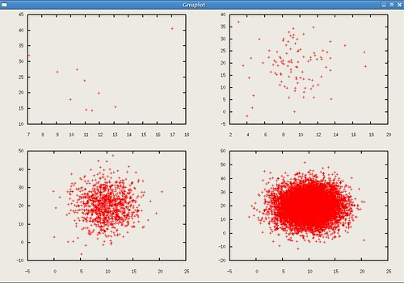
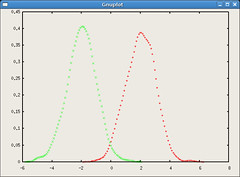
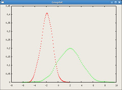

這幾天上課的老師出了幾個需要畫圖的習題，大致上是要用常態分佈取樣幾個點，X 軸跟 Y 軸給不同的 mean 跟 standard deviation 繪製圖形。另外一個作業是繪出高斯分佈取樣的點的 probability density function。 剛開始還考慮用 perl 來解題，後來想說順便學一下 python，就試著用它來寫寫看。  
  
跟 [TimChen](http://timchen119.blogspot.com/) 要了些初學者用的網站，就開始看著 [咬一口 python 程式語言](http://limodou.51boo.com/book/8/)這本線上書籍學 Python。看完幾頁之後，就發現 python 比想像中的好上手，程式碼也很簡潔。接下來就開始思考要如何解題。  
  
第一個，我需要有高斯分佈的取樣點，馬上查了 "[python gaussian distribution](http://www.google.com.tw/search?q=python+gaussian+distribution)"，有內建函式！很好很好，馬上就先解決取樣的問題。取樣完後需要 gnuplot 來畫圖。剛開始我打算先輸入到檔案裡面，再用 os module 來呼叫 gnuplot。在這個時候我又查了 "[python gnuplot](http://www.google.com.tw/search?q=python+gnuplot)"，沒想到又有！原來 python 有提供 gnuplot 的橋接，只要安裝 python-gnuplot 就可以使用了。所以這個問題就解決了，大約花了 30 行左右：  
  
```
_#!/usr/bin/env python_  
  
**import** random, os, Gnuplot  
  
mean \= 3  
strdev \=  10  
ns \= \[10, 100, 1000, 10000\]  
g \= Gnuplot.**Gnuplot**()  
**g**('set multiplot')  
**g**('set size 0.5,0.5')  
  
**for** i **in** **range**(0, 4):  
 gauss \= **list**()  
 **for** j **in** **range**(0, ns\[i\]):  
     gauss.**append**(**list**())  
     gauss\[j\].**append**(random.**gauss**(mean, strdev))  
     gauss\[j\].**append**(random.**gauss**(mean, strdev))  
  
 **if** i \== 0:  
     **g**('set origin 0,0.5')  
 **elif** i \== 1:  
     **g**('set origin 0.5,0.5')  
 **elif** i \== 2:  
     **g**('set origin 0,0')  
 **else**:  
     **g**('set origin 0.5,0')  
  
 g.**plot**(gauss)  
  
**g**('unset multiplot')  
**raw\_input**('Please press return to continue...\\n') 
```  
  
[](http://www.flickr.com/photos/yurenju/482615464/ "Photo Sharing")  
  
Cool, 很好用。第二題要畫高斯分佈的 PDF，算這東西真的還蠻花時間的，後天就要交作業還是抱一下佛腳好了…。搜尋一下發現[這東西](http://bonsai.ims.u-tokyo.ac.jp/%7Emdehoon/software/python/Statistics/)，可以直接算出 PDF，當然又是直接拿來用…。  
  
```
_#!/usr/bin/env python_  
  
**import** statistics, random, Gnuplot  
  
gauss \= **list**()  
gauss2 \= **list**()  
gpdf \= **list**()  
gpdf2 \= **list**()  
g \= Gnuplot.**Gnuplot**()  
  
**for** i **in** **range**(0, 1000):  
 gauss.**append**(random.**gauss**(-2, 1))  
 gauss2.**append**(random.**gauss**(2, 2))  
 _#gauss.append(random.gauss(2, 1))_  
 _#gauss2.append(random.gauss(-2, 1))_  
  
y, x \= statistics.**pdf**(gauss, kernel \= 'Gaussian')  
w, z \= statistics.**pdf**(gauss2, kernel \= 'Gaussian')  
  
**for** i **in** **range**(0, **len**(x)):  
 gpdf.**append**(**list**())  
 gpdf\[i\].**append**(x\[i\])  
 gpdf\[i\].**append**(y\[i\])  
  
**for** i **in** **range**(0, **len**(w)):  
 gpdf2.**append**(**list**())  
 gpdf2\[i\].**append**(z\[i\])  
 gpdf2\[i\].**append**(w\[i\])  
  
g.**plot**(gpdf, gpdf2)  
**raw\_input**('Please press return to continue...\\n') 
```  
  
[](http://www.flickr.com/photos/yurenju/482615466/ "Photo Sharing") [](http://www.flickr.com/photos/yurenju/482615468/ "Photo Sharing")  
  
作業完成！  
  
結論，Python 真的是好物阿！如果有寫其他程式語言的經驗，Python 是相當好學的東西！