十一人。  
  
這真是個令人訝異的數字啊，好久沒有這麼大規模的出團了。這次由尋召集，找了一些以前高應大電機系的夥伴們一起到阿里山玩。成員有小包、尋、小朱、十億元、大頭、總裁、逸強、小Ｑ、半隻、發哥、金寶。  
  
[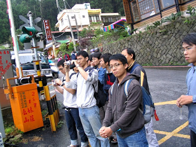](http://picasaweb.google.com/yurenju/GLeuNL/photo#5067307296825967442)  
  
這次真的很殺，因為大部分的人都是從高雄、台南騎車出發，到達嘉義市區後又直上阿里山，如果是我的話應該會累癱吧，哈哈。不過他們還是順利的騎到嘉義市了。因應總裁的要求，我們雖然知道不怎麼好吃，但是還是吃了不會噴水的噴水火雞肉飯。  
  
[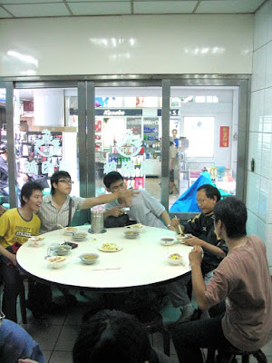](http://picasaweb.google.com/yurenju/GLeuNL/photo#5067307232401457842)  
  
中途我們在天長地久橋、奮起湖前的某個小村落休息。大家都很嗨啊。  
  
 [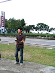](http://picasaweb.google.com/yurenju/GLeuNL/photo#5067307279646098210) [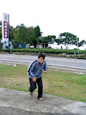](http://picasaweb.google.com/yurenju/GLeuNL/photo#5067307283941065522)  
  
到奮起湖後，一定要去參觀的景點當然就是老街、奮起湖火車站，不過這幾個地方真的拍過很多次了，所以照片就比較少一點。十億元不知道嗨什麼…。  
  
[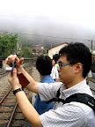](http://picasaweb.google.com/yurenju/GLeuNL/photo#5067307490099495954) [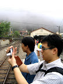](http://picasaweb.google.com/yurenju/GLeuNL/photo#5067307494394463266)   
  
還有陷入沉思跟鐵軌中的總裁  
  
[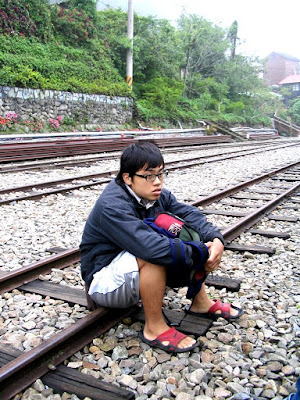](http://picasaweb.google.com/yurenju/GLeuNL/photo#5067307464329692114)  
  
其實大家都蠻嗨的，雖然說偶爾會下點雨  
  
[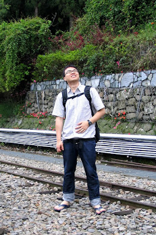](http://picasaweb.google.com/yurenju/GLeuNL/photo#5067307481509561330)  
  
逛老街、火車站，吃完愛玉伯ㄟ愛玉後，就到了紀念品店買木頭明信片啊、書籤這類的東西。去年應該蠻多人在聖誕節的時候收到我小小的聖誕禮物吧？就是在這邊買的。不過每次到這個地方都會停留蠻久的，寄明信片總是要花一點時間。原本想說去找孔咖啡的老闆，看看他還記不記得我，很可惜因為今天下雨，所以他就沒有上山了。  
  
搞定之後，我們就上阿里山了，不過因為行程有點延遲，所以到山上的時候已經七點了。這次終於人數夠多，叫了合菜來吃，其實人多的話叫一桌兩千元的真的可以吃得蠻不錯，又吃得飽。而且摳到不行的小Ｑ竟然請客了！這大概可以列為阿里山七大不可思議吧。  
  
晚上聊天打屁玩牌看電視後，我又是那個很快就屈服在被窩裡的人…。  
  
隔天，下雨。  
  
沒看到日出很可惜，從祝山回來後小小休息一下，後來就到森林遊樂區裡面走走。  
[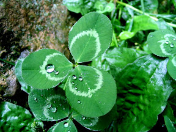](http://picasaweb.google.com/yurenju/GLeuNL/photo#5067307606063613266) [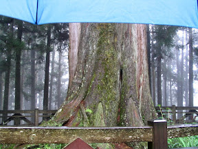](http://picasaweb.google.com/yurenju/GLeuNL/photo#5067307618948515186) [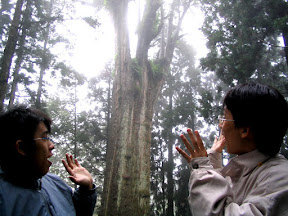](http://picasaweb.google.com/yurenju/GLeuNL/photo#5067307636128384434) [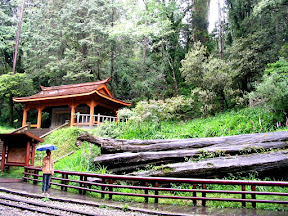](http://picasaweb.google.com/yurenju/GLeuNL/photo#5067307657603220962)  
  
真的很難得有機會，可以再找到這麼多高應大的朋友一起出來玩，這次雖然說下雨有點可惜，但是還是覺得很不錯。而且這麼多人這麼多意見的行程規劃，我想尋也搞得蠻累的，不過辛苦的代價總是值得的，我覺得很好玩呢！地點、天氣雖然說是會影響行程的因素，不過真正能讓大家都開心的，則是那種久違後，又可以聚在一起的感覺。  
  
所以，鄉親啊，高應大硬不硬～～～