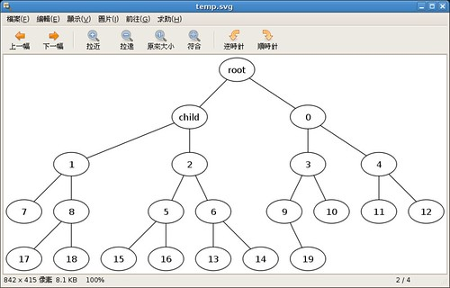

之前的[文章](http://yurinfore.blogspot.com/2007/05/python.html)提到了用 Python 與 Gnuplot 解決作業之後，我就大量的使用 Python 來解決各項課業上的問題。  
  
最近正在實作 [BATON](http://scholar.google.com/scholar?hl=en&lr=&cluster=1332811958184336277) 的演算法，當仁不讓的還是使用 Python 來解決這個問題。以下是我要實作演算法的虛擬碼：  

```
Algorithm: join(node n)  
If (Full(LeftRoutingTable(n)) and  
Full(RightRoutingTable(n)) and  
((LeftChild(n)==null) or (RightChild(n)==null))  
Accept new node as child of n  
Else  
If ((Not Full(LeftRoutingTable(n))) or  
  (Not Full(RightRoutingTable(n))))  
 Forward the JOIN request to parent(n)  
Else  
 m=SomeNodesNotHavingEnoughChildrenIn  
      (LeftRoutingTable(n), RightRoutingTable(n))  
 If (there exists such an m)  
    Forward the JOIN request to m  
 Else  
    Forward the JOIN request to one of its  
    adjacent nodes  
 End If  
End If  
End If  

```

而下面的則是 Python 實作的程式碼：  

```
def join(child, n):  
if Full(n\['LeftRoutingTable'\]) and \\  
Full(n\['RightRoutingTable'\]) and \\  
((n\['LeftChild'\] \== None) or (n\['RightChild'\] \== None)):  
 print '    ' + str(n\['Name'\]) + ' -- ' + str(child\['Name'\]) + ';'  
 accept(child, n)  
else:  
 if not Full(n\['LeftRoutingTable'\]) or not Full(n\['RightRoutingTable'\]):  
     join(child, n\['Parent'\])  
 else:  
     m \= NodesNotEnoughChildren(n\['LeftRoutingTable'\], n\['RightRoutingTable'\])  
     if(m != None):  
         join(child, m)  
     else:  
         \# Forward the JOIN request to one ofits adjacent nodes  
         if n\['LeftAdjacent'\] != None:  
             join(child, n\['LeftAdjacent'\])  
         else:  
             join(child, n\['RightAdjacent'\])  

```

  
是不是與虛擬碼非常相似呢？撰寫完演算法後，還有一個工作就是要視覺化的表達樹的結構。正巧這幾個禮拜在[紅塵一隅間拾得](http://greenisland.csie.nctu.edu.tw/wp/)的[文章](http://greenisland.csie.nctu.edu.tw/wp/2007/04/13/989/)裡面提到了 [graphviz](http://www.graphviz.org/) 這個非常好用的工具，可以用來產生各種有向、無向圖形。所以就利用這個工具來產生圖形，而 Python 呼叫外部程式當然也是很簡單：  

```
def node(name):  
return {  
    'Parent' : None,  
    'LeftChild' : None,  
    'RightChild' : None,  
    'LeftRoutingTable' : list(),  
    'RightRoutingTable' : list(),  
    'LeftAdjacent' : None,  
    'RightAdjacent' : None,  
    'Name' : name,  
    'Level' : 0  
}  
  
def travel(node, tstr):  
if node\['LeftChild'\] != None:  
    tstr += '    ' + str(node\['Name'\]) + ' -- ' + str(node\['LeftChild'\]\['Name'\]) + ';\\n'  
    tstr \= travel(node\['LeftChild'\], tstr)  
if node\['RightChild'\] != None:  
    tstr += '    ' + str(node\['Name'\]) + ' -- ' + str(node\['RightChild'\]\['Name'\]) + ';\\n'  
    tstr \= travel(node\['RightChild'\], tstr)  
return tstr  
  
root \= node('root')  
child \= node('child')  
join(child, root)  
  
for i in range(0, int(sys.argv\[1\])):  
c \= node(i)  
join(c, root)  
print 'Finish\\n'  
  
tstr \= travel(root, '')  
  
temp \= Template('graph G{\\n$info\\n}\\n')  
s \= temp.substitute(info\=tstr)  
  
file \= open('temp.dot', 'w')  
file.write(s)  
file.close()  
  
os.system('dot -Tsvg -o temp.svg temp.dot')  
os.system('eog temp.svg')  

```

執行完程式後 Eye of GNOME 就開啟了這張繪製好的 SVG 圖檔。  
  
[](http://www.flickr.com/photos/yurenju/516142171/ "Photo Sharing")  
  
Python 是個好東西阿！