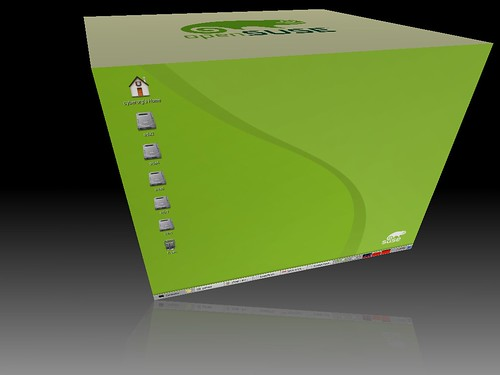
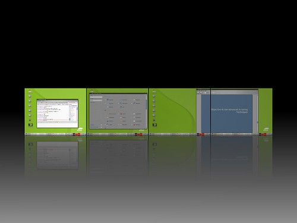
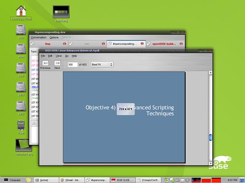
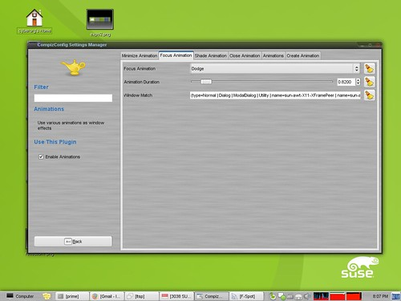
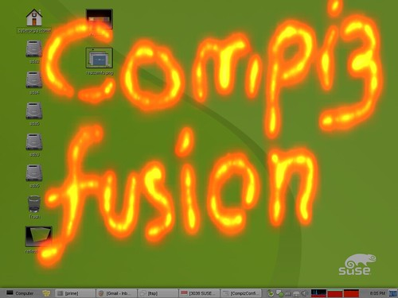

首先，目前已經有一個新的名字：Compiz Fusion。這個應該是已經確定的名字。其次多了許多之前沒有的效果。以下照片引用自 [Compiz-Fusion arrives](http://dev.beryl-project.org/%7Ecyberorg/beryl/36/compiz-fusion-arrives/ "Permanent Link: Compiz-Fusion arrives")。  
  
首先是鏡面效果。新的旋轉桌面下面，都多了反射的效果。  
   
第二個是縮放時會顯示視窗尺寸資訊。  
  
  
而且還有新的管理工具，看起來有點像原本的 Beryl，到底實際上有何改變，就要等待 Compiz Fusion 發行了。  
  
  
Firepaint，可以用火焰效果在螢幕上寫字。如果以後簡報的時候拿出這個外掛，大概會嚇死人吧。  
  
  
最後一個是名為『Dodge』的效果，這個效果在你選擇視窗時，會動態的移動其他視窗到背景去，有圖有真相，以下影片展示目前開發中的 Compiz Fusion 畫面，看完這個 Demo，感覺起來比起目前我用的 Beryl 版本（Ubuntu 內附）還有成熟許多。尤其是旋轉視窗切換，感覺起來很順暢，不像現在的旋轉那麼突兀。還有超多超炫的效果，這絕對不是上面靜態的圖片可以形容的。