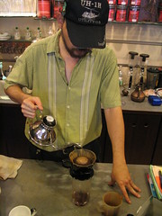
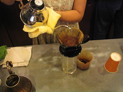
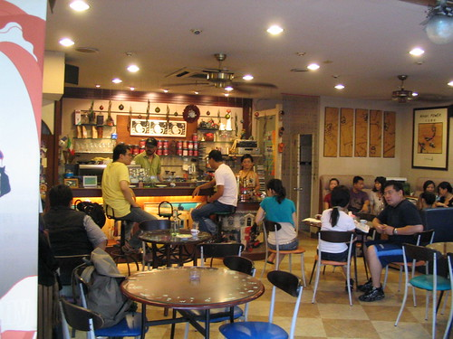
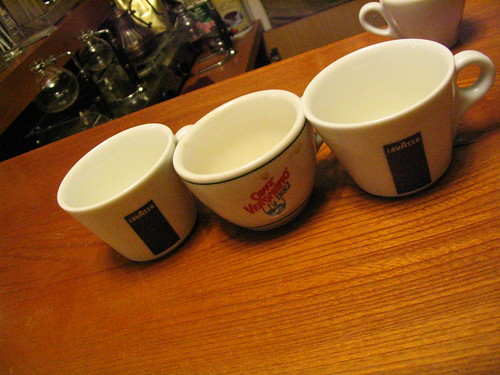

今天在大雨茫茫下，很殺的衝回高雄。為的是聖米咖啡會加上季洋咖啡赴約。而今天是我這二十四年來吸收咖啡因最多的一天。在聖米先來了一杯新進的 espresso，接著在巴拿馬比賽豆、聖安東尼歐、安提瓜寶石莊園、吉力馬札羅山。吃晚餐後，再到季洋咖啡喝了那米尼塔、卡門、巴西(忘記莊園名)、最後以一杯肯亞 AB Top 結尾。  
  
今天在聖米的聚會，依然是鬍子大戰巫婆。  
  
  
  
  
我想樓上這兩位應該可以去演雙簧了，今天的唇槍舌戰比往常多阿 XD  
  
(更新：應該是說演相聲…)  
  
今天喝的咖啡真的很多。說到最有印象的，是鬍子的第一杯巴拿馬。Body 濃厚，有強烈回甘。而同支豆子由巫婆沖出來的風味則是流竄脣齒的香氣。雖然我比較喜歡鬍子的，不過第一杯咖啡也是很佔優勢啦，很久沒有喝到單品咖啡了耶。  
  
聖安東尼歐則是覺得味道好像沒有開。雖然喝的時候有香氣卻不重。聞起來的味道也悶悶的。  
  
寶石莊園的則是我覺得這三支裡面比較好的一支。鬍子煮的寶石，喝下時是從舌尖直到尾端的酸。不過一下子就消失無蹤了。而巫婆沖的第二杯則是典型的『巫婆式好咖啡』，滑順的酸配合淡淡的香氣，殘留在口中。  
  
不過今天下雨的關係，濕度較高似乎多少也影響了鬍子巫婆。沒下雨我想應該可以喝到更超水準的咖啡 :D  
  
  
  
晚餐吃完後，緊接著是到很久沒去的季洋！今天是老闆娘操刀。每杯都是 full size，也就是都是平常單品咖啡的杯子八分滿…，還好在聖米那邊我還有留點 quota 可以用…。還有這邊全部都是 syphon 壺沖煮。  
  
第一支就是那米尼塔。我每次喝到那米尼塔的味道都是一樣的。偷偷的說…那米尼塔不是我的菜…。他就像甜美的乖女孩一樣，內在外在大家都很愛，不過乖乖牌中規中矩而且每次都相同的風味，就是讓我對她興趣缺缺。當然它是支好豆子，大家都說讚，只是我沒那麼愛就是了。  
  
第二杯是卡門。這杯真的超甜的…，也是一款各方面表現良好的豆子。第三杯是巴西某莊園，也是各方面平均的豆子。  
  
最後！則是用肯亞 AB Top 結尾。今天讓我印象深刻的單品，就是第一支跟最後一支。雖然說喝了這麼多，真覺得快不行了。不過最後面這杯還是讓我有些救贖的感覺。讓那種前面一片甜到膩的味道一掃而空，取而代之的是肯亞出產的咖啡標榜的酸，徘徊在口中的香氣。一點點野的花香。彷彿這杯咖啡偷偷了夾帶了耶加雪夫的美妙一般。  
  
阿。現在3點了我還不想睡，我想頭頂上這群不斷轉圈圈的咖啡杯，應該都要負起一點責任吧。  
  
謝謝招待。  
