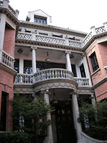

上海是最後一站了。來到上海原本的期待是要來看看比台北更繁華的地方。因為上海算是一個比較晚發跡的地方，所以歷史或古蹟之類的建築或風景比較少。  
  
但是到了上海一些地方，發現其實這個新的地方，也是經營的有聲有色。首先到了新天地，這是上海人跟來上海的外國人喝咖啡的地方。這邊保留的舊式洋房的特色，把洋房的特色精巧的融入到商業的餐飲業當中，看起來竟然十分復古、懷舊，非常有當地特色。  
  
   
  
接著到了城隍廟商圈。我們的導遊說如果之前在各地有沒有買到的紀念品，在這邊幾乎都可以買的到。不過在一個逛了好幾天紀念品的人來說，我只想坐在星巴克裡面看看人潮，喝個星冰樂阿。  
  
  
  
最後是無敵黃浦江夜景，當然實景看起來比照片好看多了。  
  
   
  
還有登上東方明珠電視塔，往下俯瞰的上海夜景。  
  
   
  
套一句我們中國導遊的口頭禪，中國江南遊的旅行到一個段落：『這樣，就 OK 啦。』  
  
