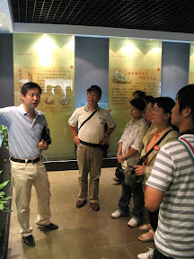
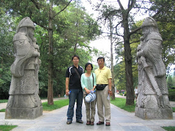

跟團旅行有三種導遊，台灣導遊、全陪、地陪。全陪是中國導遊，在所有行程裡面跟著我們一起吃喝拉撒，解決生活各種問題。地陪是當地導遊，每一個城市都會有一個地陪，離開後就會跟我們 Say Goodbye。  
  
而這次南京的地陪是方老師。方老師對於南京城的了解非常透徹，不僅把南京交代的巨細靡遺，而且活潑生動又有深度。這位地陪是所有行程中最上道的地賠了，對於風水也有相當程度的了解。  
  
  
  
南京城給我的印象，就是一個十分悠久文化以及重視風水的地方。方老師整路上大多都在跟我們說風水以及南京文化。像是南京的代表吉祥獸貔貅、南京為玉石雕刻大本營、南京的帝王之都等。不過南京最有看頭的我認為是明孝陵。雖然現在明孝陵因為古蹟保存問題，怕像兵馬俑一樣開挖顏色就全部氧化，所以目前並不打算開挖明孝陵。明孝陵的歷史已經很悠久了，一進去就有宏偉的古代建築，配合陵道上許許多多用已經絕跡的玉石所興建的雕像。雖然說只有陵道，不過還是很有看頭。  
  
  
  
不過方老師剛開始忘了提醒說不走回頭路，很多該拍的都沒拍到。  
  
明孝陵後，中山陵我是覺得第二個該去看的點。中山陵並非衣冠冢，所以孫中山先生的遺體就在中山陵內。這邊方老師講了一個很有趣的風水觀點，他說國民黨葬孫中山先生時在碑上題：  

> 中國國民黨葬  
> 總理孫先生於此

方老師說這碑斷字在葬與總之間，看起來就好像中國國民黨已末的感覺，所以當時才會打輸共產黨，不過他也說這只是民間趣聞而已。方老師在路上還講了許多這種跟風水有關的趣事，感覺起來肚子裝蠻多墨水的。  
  
不過南京這個地方，我想只要來一次就夠了。除非明孝陵開封後，看看會不會更有看頭。