杭州是我們唯一待兩夜的城市，但是杭州真的有很多地方可以去看看的。在中國，杭州是一個發展觀光的重要都市，所以在這邊除了有許多歷史悠久的特色如相傳《白蛇傳》中白素貞被封印的雷峰塔、西湖蘇隄、虎跑泉以外，還有現代興建的觀光地區如宋城等。  
  
西湖這地方非常美麗。不過這邊真的人多到我不知道該怎麼下手，僅僅也只收了二到三張照片。  
  
[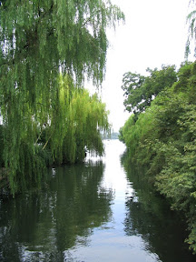](http://picasaweb.google.com.tw/yurenju/Jiangnan/photo#5102104293392016610) [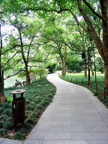](http://picasaweb.google.com.tw/yurenju/Jiangnan/photo#5102104396471231746)  
  
坐船到西湖對面後，登上了雷峰新塔。雷峰塔於1924年9月25日倒塌，而目前看到的則是雷峰新塔。雷峰新塔為七層的建築，其中最下面兩層是將原本的雷峰舊塔遺址完全的包覆，從第三層開始才是雷峰新塔。這邊也有個很奇怪的事，就是他們都把硬幣丟到雷峰舊塔上，是有許願的功效嗎？  
  
[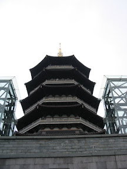](http://picasaweb.google.com.tw/yurenju/Jiangnan/photo#5102104417946068242) [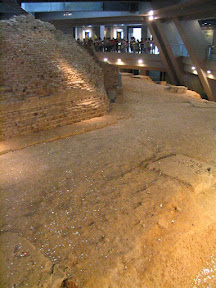](http://picasaweb.google.com.tw/yurenju/Jiangnan/photo#5102104456600773922)  
  
而塔頂看整個西湖真的非常美麗。可惜小小的 A70 配上我沒什麼重點的取景，倒是看不出來美在哪，但其實是非常漂亮的。  
  
  
  
塔內還有大量極為精緻的雕刻：  
  
  
  
接下來是宋城。宋城是中國近日興建的大型景點，其中多數描寫宋朝時杭州的美景以及民情風俗。不論是建築或是裝扮都蠻有風味的（雖然不知道是否真為宋朝風格）  
  
[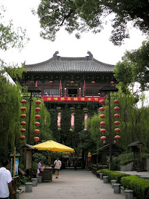](http://picasaweb.google.com.tw/yurenju/Jiangnan/photo#5102104903277372914) [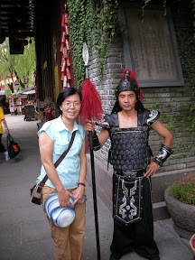](http://picasaweb.google.com.tw/yurenju/Jiangnan/photo#5102104933342144002)  
  
要打鐵有打鐵的：  
  
[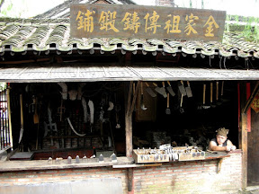](http://picasaweb.google.com.tw/yurenju/Jiangnan/photo#5102105010651555362)  
  
要皇帝有皇帝，這是同團的帥氣藍老師：  
  
[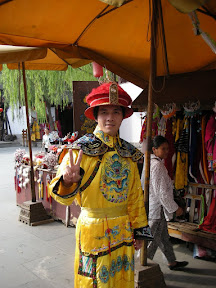](http://picasaweb.google.com.tw/yurenju/Jiangnan/photo#5102105066486130242)  
  
裡面的景物也建造的非常漂亮，真看不出來是現代品。  
  
[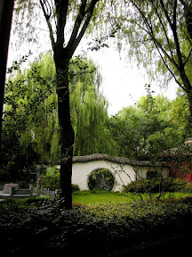](http://picasaweb.google.com.tw/yurenju/Jiangnan/photo#5102105182450247282) [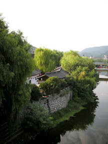](http://picasaweb.google.com.tw/yurenju/Jiangnan/photo#5102105328479135442)  
  
連廁所都古色古香！  
  
[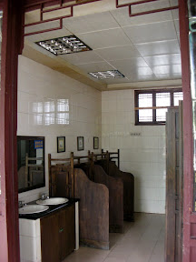](http://picasaweb.google.com.tw/yurenju/Jiangnan/photo#5102105255464691362)  
  
不過在這邊，最有看頭的是宋城歌舞秀了。宋城歌舞秀是結合了歌舞、特技、舞台科技的表演，企圖詮釋杭州的歷史、傳說以及現代國際化的角色。但我覺得這場表演真的跟烏鎮的精采程度有得拼，來杭州真的要來看一下。不過我覺得他們的表演者還蠻可憐的。因為現場並沒有禁止拍照，而絕大多數的人竟然就拿起閃光燈猛閃。當表演者在做一些高難度動作時，這樣做真的非常危險，而且也很不禮貌。  
  
杭州真的是個很棒的地方，不管是風景或是人文。來中國第一個可以感受到的，就是這邊的每個司機都猛按喇叭，只要開到路上，喇叭聲真的是綿延不絕。但是跟其他地方比起來，杭州的喇叭聲就明顯的少很多。這也是蠻不錯的一點。  
  
如果說到來中國覺得最值回票價的地方，那就是杭州跟烏鎮了。