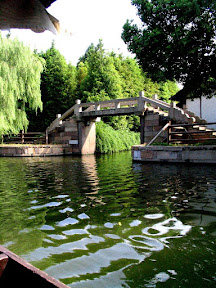
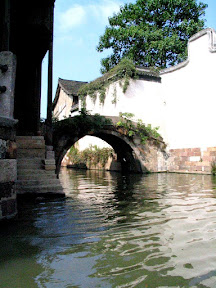
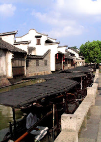
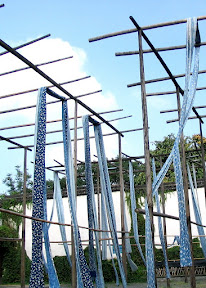
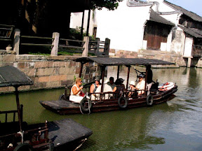

烏鎮是一個介於蘇州與杭州之間的水鄉。這邊可以稱做是中國的威尼斯，整個鎮水路四通八達，搭著這邊的烏盆船就可以到處遊蕩。而且導遊跟我們說這邊最熱鬧的時候就是早上。賣菜的攤販會在運河上叫賣。如果想要買什麼菜，只要從窗戶口跟小販交易即可。窗子高一點的，也只要用菜籃把錢垂下，小販把菜跟找零放到籃子裡拉上來即可。另外水路的另外一面其實也有陸路可以行走，是個海陸合併的交通方式。  
  
其實上面都是廢話，重點是烏鎮保留許多古老的建築，並且將極有特色的水陸兩用的交通方式完整的保存。這邊的居民還保留的部份的生活方式，在修繕建築時，也必須要保持『修舊如舊』的政策，讓這邊的建築看起來永遠是這麼的典雅、古色古香。  
  
最後，這是一個很殺記憶體的地方，處處是美景啊！  
  
     
  
在這邊看到老外坐烏盆船，真是有股說不出的不搭。  
  
