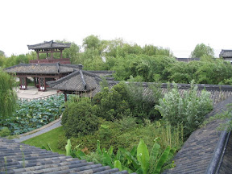
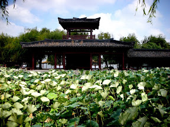
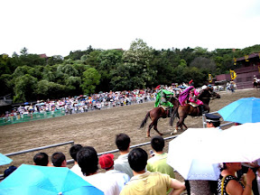
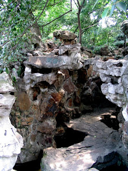
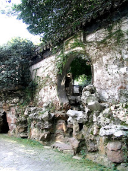

南京結束後就到了無錫。說到來無錫的重點其中有一項就是無錫排骨。感覺起來像是糖醋排骨，不過又多鹹了一點，還蠻好吃的。  
  
除了無錫排骨以外，這邊的三國城也蠻有看頭的。三國城與水滸城比鄰而居，這兩座城都是為了拍電影、電視劇所搭建的仿古城，三國城用來拍攝三國時代的戲劇，所以有吳皇宮之類的建築。雖然說是新建築但看起來還是古色古香呢。  
  
   
  
這邊裡面表演的《三英戰呂布》也蠻精采的，每個主要角色出來的時候都會來一段 solo，這些人真的是馬術了得阿，尤其時最後一段呂布跟劉備一干人四人並行騎馬，手上還在用兵器廝殺，看起來是蠻危險的，不過也很精采嚕。  
  
  
  
另外寄暢園也是一個很漂亮的景點，裡面有許多假山小橋流水，也有許多乾隆的字畫。  
  
 