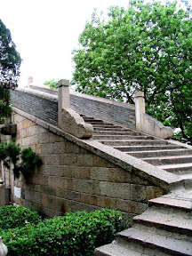
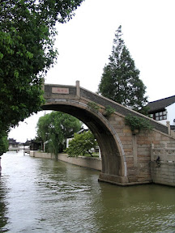
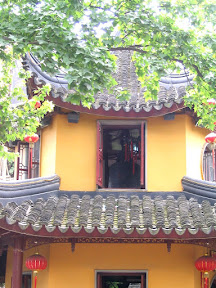
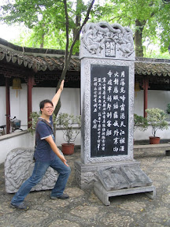

說到蘇州大部分的人都會想到：  

> 上有天堂，下有蘇杭。

第二個會想到楓橋夜泊：  

> 月落烏啼霜滿天  
> 江楓漁火對愁眠  
> 姑蘇城外寒山寺  
> 夜半鐘聲到客船

當然，還有有些人想到...  

> ＸＸＸ到蘇州賣鴨蛋了。

不管怎樣，美景、寒山寺、鴨蛋幾乎可以成為蘇州的代名詞了。而這次我們到寒山寺大概是我們所有去過的景點算是蠻小的一個地方。但是因為楓橋夜泊的關係，古今中外的華人沒有一個人不知道寒山寺這個地方，所以還是得來這個地方。很遺憾的，寒山寺幾乎都是現代建築，比起一些古蹟跟風景，就沒什麼好看的，不過在他名氣這麼大的份上還是得來看一下。  
  
   
  
當然還有夜半鐘聲到客船的鐘。敲是要收費的，所以我就沒敲，只拍了一張模糊的照片以示負責。  
  
   
  
然後去獅子林這個景點，裡面的假山流水也是美不勝收。不過缺點就是人多的跟螞蟻一樣。中國的任何景點都一樣，到處都是人阿。這個景點照片收的很少，而且老實說，我分不太清楚寄暢園跟獅子林到底是哪幾張了 XD  
  
有興趣的可以去看一下沒有說明的那幾張，大概就是惠山寺、寄暢園跟獅子林。最後去了蠶絲被工廠，後來就前往蘇州以及杭州之間的一個水鄉小鎮 - 烏鎮。