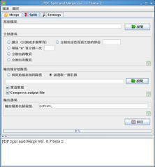
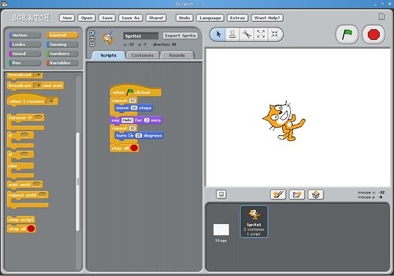
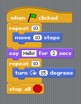

我回來啦！  
  
這次 KaLUG 八月份聚會由 Menterning 介紹 pdfsam 以及 Scratch，DIY 先生介紹 DRBL 在 Ubuntu 上安裝的經驗分享。  
  
pdfsam 是一套由 Java 撰寫的 PDF 合併與切割的工具，同時有合併以及切割的功能。使用上也蠻簡單使用的。  
  
  
  
Menterning 還講到了一個神奇的功能。有許多 PDF 文件會有保護機制，沒辦法全文複製。Menterning 說只要用 pdfsam 切過的檔案，這個保護機制就會失效了，這功能還真超級實用阿…。  
  
另外一個 Scratch 則是一套程式語言。主要是給小孩子訓練邏輯思考的能力。運作畫面如下：  
  
  
  
這個語言的程式碼就像樂高一樣，要用組合的方式兜起來。像是範例的這個程式碼：  
  
  
  
這段程式的意思就是按下綠色的旗幟後，迴圈將會重覆十次，每次都將卡通人物移動十步，接下來說兩秒的 Hello!，最後再用一個重覆十次的迴圈旋轉卡通人物的角度。  
  
這個程式語言真的很好玩。可惜是英文的，否則給國小生訓練邏輯概念應該不錯。  
  
DIY 這次講的是 DRBL 安裝在 Ubuntu 的經驗分享。DRBL 是一套由國家高速電腦中心所開發的國產軟體，功能是利用一臺中央伺服器儲存作業系統，而 Client 連接時直接從網路開機，不需要任何硬碟。這系統使用在教室上很方便。管理者僅需要更新伺服器的設定，不需要每台電腦都一一安裝或者是更新。  
  
而經過 DIY 的介紹後才了解到 DRBL 真的是相當完整，安裝步驟也很簡單。並且在各個國家嶄露頭角，像是印度、東京都有安裝 DRBL，之前在法國的開放源碼大會也有請開發者去演說。可謂是自由軟體介的臺灣之光阿。  
  
另外，今天來了一個遠從台北來的神秘人物 - Knight，乃特大。主要是協調 COSCUP 的事宜。乃特大舟車勞頓的南奔北跑，真是辛苦啦。