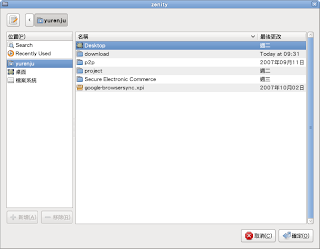

這次的 KaLUG 因為 qerter 的筆記型電腦切換外螢幕有點麻煩，必須要重開 X，在跟他介紹新的 xrandr 工具時，順便介紹了 zenity 這個小工具。  
  
這東西是我在用 python 寫些小工具處理 lazybuntu 中選擇輸入法用到的。因為要選擇輸入法時，需要跳對話視窗讓使用者選擇愛好的輸入法，不過我又不太會用 pygtk，後來想到了好久好久以前好像有在某一版的 gnome release note 看過這種可以簡易產生對話框的小工具，後來找一下就發現了 zenity。  
  
zenity 可以做什麼勒？鍵入以下指令就可以看出些端倪：

> zenity --file-selection

這樣會顯示以下畫面：  
如果點選了 "google-browsersync.xpi"，則會在 STDOUT 回傳  

> /home/yurenju/google-browsersync.xpi

其實 zenity 就是一個簡單的對話框產生器，可以產生各式各樣的對話框如問題、資訊、列表、日曆、檔案選擇等等。像是我之前在 lazybuntu 寫的輸入法選擇 script (後來 pcman 有修改過)：  
這個對話框也是用 zenity 產生的，只要在後面加上適當的參數即可。當你要寫些只有一點點 GUI 的小程式，不妨用 zenity 來產生對話框，可以節省不少時間。  
  
zenity 只要你安裝 GNOME 通常都會附在裡面，目前我用過的 Ubuntu, Debian 裡面都有 zenity。更多資訊可以參考 zenity --help，裡面寫的很完整，也有中文翻譯。  
  
那程式語言有沒有直接 binding zenity 呢？當然是有啦。Kevinwatt 跟 qerter 分別寫了 python 跟 perl binding 的文章，有程式語言 binding 讓 zenity 更方便！  

1.  [Kevinwatt’s Blog » Blog Archive » PyZenity](http://kevinwatt.net/blog/?p=30)
2.  [旺伯’s Blog » Blog Archive » UI::Dialog::Backend::Zenity](http://qerter.im.nuk.edu.tw/blog/index.php/2007/10/15/mod-zenity-perl/)