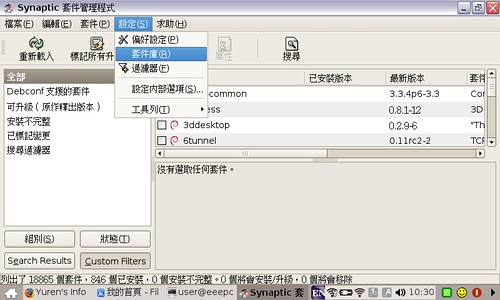
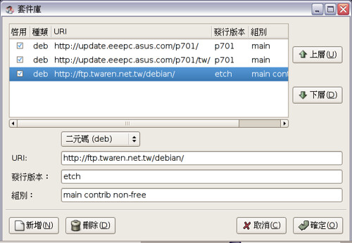

觀察跟測試後，EeePC 是相容於 Debian Linux (Etch) 的。也就是說 debian 的許多軟體都可以直接拿來 EeePC 用。如果要把 debian 的軟體拿來用，首先要在 EeePC 內設定 debian 的套件庫。編輯套件庫列表。注意，此步驟需要連上網路。  
  
按下 Ctrl + alt + t (這個步驟要等一下，之後會出現一個黑色的輸入視窗，叫作終端機，以下動作請不要關閉終端機)  
  
輸入 sudo synaptic，按 enter 後出現以下程式後按設定→套件庫：  
  
  
  
點選新增後，依序填入：  

*   URI: http://ftp.twaren.net.tw/debian/
*   發行版本: etch
*   組別: main contrib non-free  
    

  
  
  
  
按確定後，選擇左邊的重新載入，此時會重新讀取一段時間。這樣你就可以網路直接安裝 debian 的軟體了 :-)  
  
但是現在無論安裝什麼軟體，都不會出現在選單上，因為 AsusLauncher 不會裝軟體後就自動更新。這個問題嘛，老手看到 [EeePC 自行增加應用程式連結](http://yurinfore.blogspot.com/2007/10/blog-post.html) 應該就知道怎麼做了。新手的話就稍安勿躁吧，我想想看有什麼簡單的方法可以說清楚的。