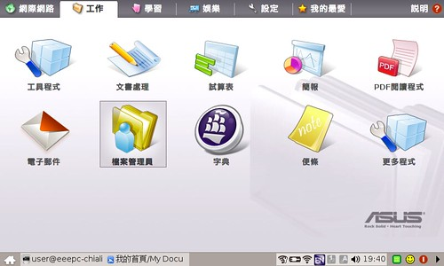
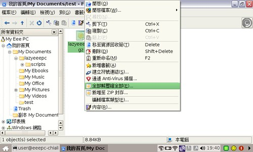
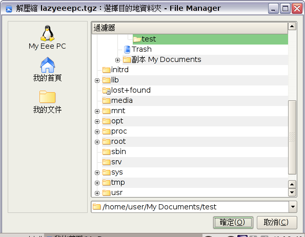
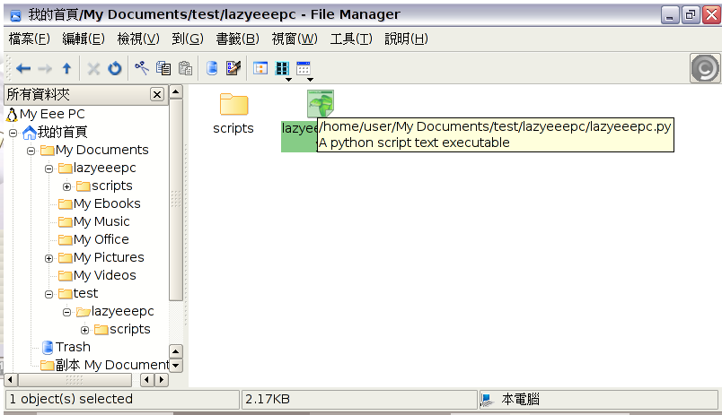
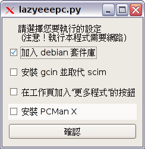
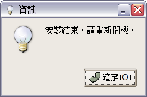
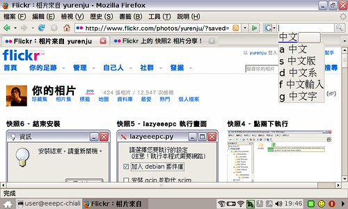
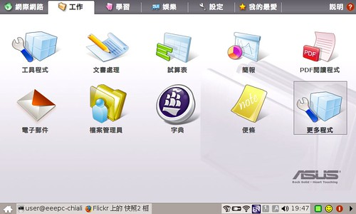
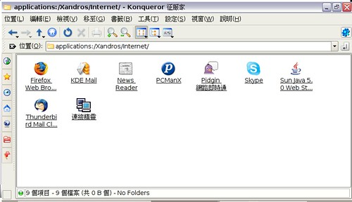

[Lazyeeepc 0.0.2 懶人包](http://yurinfore.blogspot.com/2007/10/lazyeeepc-002.html)已釋出！  
  
小弟寫了一個簡單的小程式來自動處理一下安裝 eeepc 時難搞的部份。lazyeeepc 的名字，則是因為本程式概念同於 pcman 所寫的 lazybuntu (Ubuntu Linux 底下簡化設定的懶人包)。小弟參加此專案跟 pcman 學到不少東西，帶來 eeepc 跟大家分享一下 :-)  
  
本程式為開放源碼軟體，以 GPL 授權釋出。本程式仍為早期釋出版本，通常為先行者使用。服用後若有問題，請節哀並且開機時 F9 還原。如有問題或想要自動安裝什麼軟體，請直接在本篇留言。  
  
請先到此下載 lazyeeepc 0.0.1  
[http://people.linux.org.tw/~yurenju/software/lazyeeepc\_0.0.1.tgz](http://people.linux.org.tw/%7Eyurenju/software/lazyeeepc_0.0.1.tgz)  
  
下載後執行工作頁籤的檔案管理員  
  
  
找到你下載的 lazyeeepc 後按右鍵，選解壓縮  
  
  
直接選確定  
  
  
此時會解開 lazyeeepc 目錄，請進去此目錄後對 lazyeeepc.py 連點兩下執行  
  
  
接下來顯示主畫面，第一項『加入 debian 套件庫』請一定要勾選。以後再次執行本程式則可不勾。  
  
  
接下來會跳出亂七八糟的視窗，全部跳完後會提示你重開機  
  
  
重開機後就有 gcin 輸入法可以用了。  
  
  
工作頁籤中也會多出『更多軟體』  
  
  
pcman 則在 internet 分類當中  
