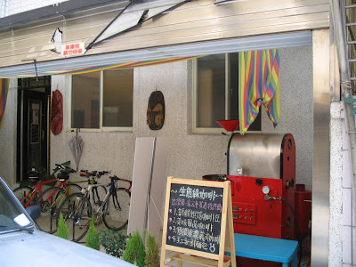
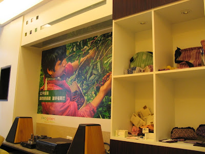

這次來台北沒有安排什麼吃飯的行程了，不過因為要省錢的關係三點多就到台北。經過許多朋友介紹還有網路上的資料，後來到這間 AndrewLee 推荐的 ökogreen 咖啡館。  
  
ökogreen 是一間四月初才開張的咖啡館，藏身於善導寺捷運站附近的杭州南路巷子內。剛看到的時候嚇了一跳，因為看起來就像住家一樣，前面還有幾個小朋友在嘻鬧 :)  
  
  
  
進去老闆問我一個人來阿？我說我是 AndrewLee 推荐來的，就問我是不是 LXDE 的開發者 (笑)。看來 AndrewLee 推廣 LXDE 得很成功。  
  
雖然來之前已經看過資料，不過現場看到還是蠻訝異的，menu 封面大大的寫著：  
  
『結帳時請於帳單上填上您願意支付的價格』  
  
我想多數的人第一次來應該要思考的問題是要決定咖啡的價格吧。而咖啡的種類有來自  

*   瓜地馬拉 (Guatemala) SHB 極硬豆
*   哥倫比亞-考卡 (Columbia Cauca) Excelso 上選級
*   哥斯大黎加 (Costa Rica) SHB 極硬豆
*   厄瓜多爾 (Ecuador) SHB
*   宏都拉斯 (Honduras) SHG Peaberry 高山小圓豆 (原來 PB 是這的單字阿，學起來了 :)
*   哥倫比亞 Excelso 上選級『雨林保護』

這邊應該是單品為主的咖啡館，而且全部都是水洗豆。跟老闆娘說我喝慣酸的豆子，果然跟我推荐哥斯大黎加的咖啡，不過我不太愛哥斯大黎加的豆子，所以又推荐了我『雨林保護』的豆子。這邊的咖啡是用愛樂壓的一種濾器，這東西是浸泡式 + 壓力式的濾器，用 90 ~ 95 度的熱水沖煮，差不多 15 克左右的份量。  
  
這杯咖啡真是驚人。不過我也很久沒有喝不錯的單品咖啡了。『雨林保護』帶點微酸，在口中彌漫的野野的香味，真是讓長途旅行的勞累都釋放了。  
  
這邊還有個神奇的特點…  
  
  
  
這邊用的是公平貿易豆，也就是讓勞動者可以得到相對應合理的酬勞。老闆娘跟我解釋了一下，公平貿易豆通常都是沒有標示莊園的，而且聽起來公平貿易豆品質還蠻穩定的，但是成本也較高，也是因為給合理酬勞的關係吧。  
  
真的非常不錯，感覺起來感覺一整個好阿，加上有無線網路跟插頭，以後有啥聚會看來可以到這邊來囉。大推阿！