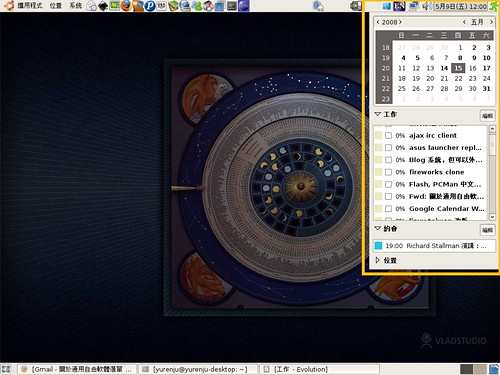
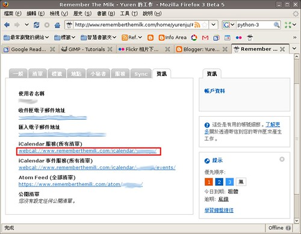
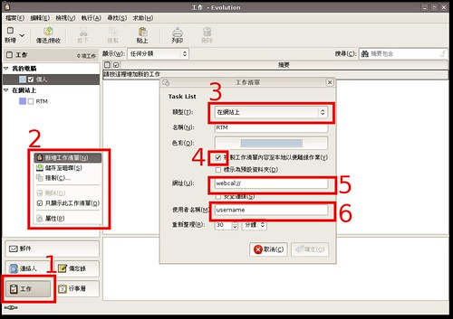

  
  
這幾天發現 Remember the milk (RTM) 支援 webcal, 而 Evolution 也支援 webcal，那如果將 RTM 的 webcal 丟到 Evolution 裏面可以讓 gnome 面板顯示工作嗎？試著做竟然可以！步驟如下：  
  
到 RTM 的設定→資訊裏面複製 iCalendar 服務(所有清單) 的位置  
  
  
到 Evolution 底下，選擇工作，在左邊按右鍵新增工作清單，選擇在網站上並且把該填的資訊填一填，像是 webcal 位置、勾選離線、使用者名稱等  
  
  
按下確定後，過一陣子 Evolution 才會問你密碼。我自己在操作的時候 Evolution 跟 gnome 面板都沒有立即出現 Remember the milk 的工作清單，我是在下次登入的時候才出現，大概是臭蟲吧。  
  
另外這也是我喜歡 Evolution 勝於 Thunderbird 的原因，GNOME 對 Evolution 的整合度遠高於雷鳥阿。  
  
PS. 再抱怨一件事情，網頁應用軟體如 Google Calendar 與 RTM，竟然比桌面軟體如 Evolution 好用，真是不可思議。桌面軟體的設計者應該要好好跟網頁程式取經阿。