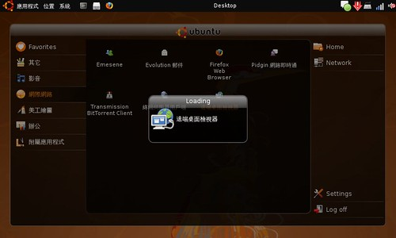
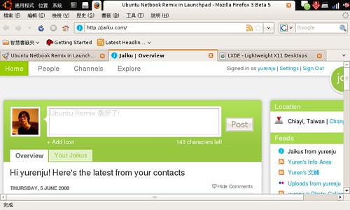

剛剛把這幾天在 Computex 發表的 Ubuntu Remix 裝到 Eee PC 上玩。有圖有真相：  
  
  
  
  
  
其中 Home applet 沒辦法正常使用，不過已經可以窺得 Ubuntu Remix 的全貌。其實 Ubuntu Remix 還是採用 GNOME，但添加了幾個 applet 跟一個叫做 maximus 的程式，讓 Window border 隱藏的小程式。另外把應用程式清單換成 window picker。再啟動一個稱為 ume-launcher 的程式，就是 Ubuntu remix 了。  
  
不過整體介面看起來還不錯，很適合在輕省電腦上面使用。  
  
下面的影片用手機拍的，所以一整個模糊囉。  
