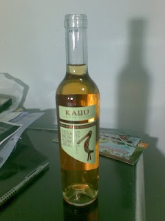

這幾天到台北找房子、聚會、教育訓練加上出去玩，緊湊中間穿插輕鬆的行程，讓這趟台北之旅過得很豐富。  
  
禮拜四的時候第一次搭乘了高鐵，才知道坐高鐵的旅行方式真的很舒適。雖然從嘉義到太保花了不少時間，不過穩定又快速的乘坐感受，果然比起國光客運要好很多，當然一張張的小朋友也萬劫不復的被吸到了自動售票機裏面。  
  
一出古亭捷運站，原來台北市大晴天阿！最近嘉義連日下雨都快長霉了。這種天氣還蠻適合找房子的 :)  
  
  

[  
@chihchun](images/0.jpg)

  
接下來去了 skadle 的聚會。skadle 是一群台北的朋友組成的小團體，主要就是寫寫小軟體自娛。這次聚會非常的輕鬆大家聊著各式各樣的話題，分享最近做了些什麼事情，沒想到時間迅速的就到十點了。跟 Mat "面交" 了 skadle 的源碼，希望晚個幾天有空可以幫忙改改美工部份。這次也見到了遠從倫敦回來的阿怪！真的是…跟照片差很多阿 XD  
  
十點過後跟這次借宿的 lulu 先生見了面，吃了師大夜市的生煎包之後後來就回去睡囉。話說 lulu住的地方還真不錯，外面還有陽台、種些花。雖然在頂樓夏天可能會比較熱，不過便宜的房價看起來非常不錯。  
  
第二天，就是非常累的找房子了。打了無數通電話，但一整天下來只看了四間房間。雖然如願以償的找到房子。不過因為在台北市的關係房價有點貴…。希望下次找房子的時候可以更順利。原本今天還想到生態綠喝咖啡的，但是整個弄完的時候已經晚上8點，就直接回去找 lulu 了。晚上因為要重新 review 明天的投影片弄到了晚上3點才睡…人老了真的還是不要太晚睡阿，超累的…。  
  
第3天，這次受到 eric sun 的邀請，這次為 [教育部校園自由軟體應用諮詢中心](http://ossacc.moe.edu.tw/) 講了關於 lazybuntu 製作的心得分享。我是下午場，上午則是由 pake 講解 ubuntu livecd 製作。以前對 pake 的印象只有 fedora 台灣的站長，因為 Taiwan Open Source Calendar 的關係通過幾次信，今天終於是實際的見了面。  
  
嘿嘿…重點是今天的講習結束後，我跟 eric 的一票朋友，4個人就殺到福隆海洋音樂季！一到了海洋音樂季，就感覺到夏天來臨的氣息阿…。比基尼、音樂、啤酒…感覺真的很棒。雖然並沒有喝酒，站的位置也不是搖滾區。但是白目樂團遠遠飄過來音樂的振動，還是讓人感受到音樂的熱力。當主唱把裝飾用的裙子脫下來丟給觀眾、穿著泳衣在台上瘋狂的唱歌時(雖然不是比基尼)，我想，我還是感受到福隆音樂季的搖滾氣氛了。雖然沒待很久，但真的很開心。  
  
後來回到礁溪的時候我們幾個就在車上喝酒(當然不包括司機)、去礁溪溫泉公園泡腳享受從腳底竄上來的溫暖、吃著隨機挑選、便宜卻又很好吃的冰品。  
  
我只能說，今天過的真是棒呆了。  
  
後來移動到小白家借宿，可惜他禮拜天臨時有事情要忙，沒辦法跟我去喝咖啡。結果小白就開了瓶白葡萄酒跟我分享。這瓶白葡萄酒真的是超級適合新手的。因為我自己喝不習慣葡萄酒也不懂得品味。所以一直都沒深入的去喝葡萄酒。但這瓶白葡萄酒甜甜的味道配上輕飄飄的酒香，加上絲毫不澀的口感，真的很適合新手來喝。有興趣的朋友可以看看這瓶[白葡萄酒的介紹](http://mypaper.pchome.com.tw/news/capone/3/1308507212/20080630144013/)。  
  

  
喝完感覺實在太讚了，帶著稍稍的酒醉入眠。從礁溪回程開始，今天晚上一直維持著微醺又還沒醉的狀態，真的很棒。  
  
第四天，今天完全沒有排行程，所以早上跟小白吃了很晚的早餐後，就搭公車回火車站買票了。不過後來還是打電話問 OD 要不要出來喝咖啡 XD。 結果去生態綠又沒有喝到咖啡，跟生態綠的緣份真是一波三折阿。後來就在火車站的死大胖子喝不是很好喝的咖啡了。這次跟 OD 講了些目前遇到的一些事情的困難處…。總覺得我還是很需要磨練的。希望工作後可以更有經驗的處理一些大小事情。  
  
總之台北四天行過的很充實。很有以前到處參加聚會、研討會的 feeling。學生生涯就快結束，我的下一段旅程也就要開始了…。希望一切都好囉。