當大嘴鳥宅配帶來這顆壓扁的金色星形氣球時，心裡竄出的感覺還真的是蠻奇妙的阿。沒想到[火狐遊台灣](http://moztw.org/events/foxmosa-tour/)的活動我也會參一腳 (BobChao 原諒我沒去參加 Firefox 3 Party XD)  
  
不過當我拿到氣球的時候！剛好就是鳳凰颱風來台的前一天啦。開什麼玩笑，不過是個 Firefox 的前身 ([Phoenix](http://zh.wikipedia.org/wiki/Mozilla_Firefox%E6%AD%B7%E5%8F%B2#.E5.90.8D.E7.A8.B1)) 而已，嚇不倒我滴~~。所以就從我龜了兩年的基地 - [嘉義大學](http://www.ncyu.edu.tw/)開始囉。  
  
剛要出發的時候，我們系館前面的草皮還有同學正在為 Foxmosa 遊台灣的活動投球熱身呢。不過別問我投球跟 Foxmosa 有啥關係…。  
  
[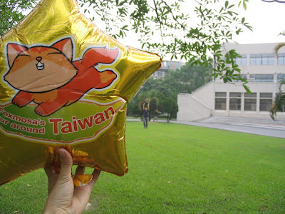](http://picasaweb.google.com/yurenju/Foxmosa/photo?authkey=hsQPgb8s_d8#5228433630957862978)  
  
  
其實嘉義大學旁邊就是[蘭潭](http://zh.wikipedia.org/wiki/%E8%98%AD%E6%BD%AD%E6%B0%B4%E5%BA%AB)了，蘭潭是個嘉義市郊的一個小型風景區，平常假日的時候蠻多人會來這邊騎自行車的。  
  
[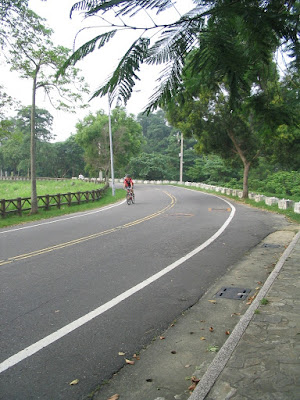](http://picasaweb.google.com/yurenju/Foxmosa/photo?authkey=hsQPgb8s_d8#5228433708131077458)  
  
蘭潭平常的時候其實蠻漂亮的，尤其是黃昏的時候，藍色的晚霞配上夕陽非常漂亮。請容許我引用一下之前在蘭潭照的相片。  
  
[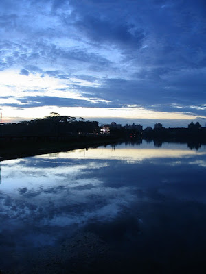](http://picasaweb.google.com/yurenju/BRWSlE/photo#5080556891129681314)  
  
所謂的蘭潭泛月大概就是這麼一回事了。可惜今天颱風前夕空氣有些霧濛濛的，比較沒辦法看出蘭潭的美。不過這當然還是嘉義市區不可以錯過的一個景點囉。當然 Foxmosa 也要湊一腳。  
  
[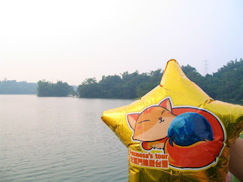](http://picasaweb.google.com/yurenju/Foxmosa/photo?authkey=hsQPgb8s_d8#5228433771872462898)  
  
  
逛完蘭潭後，發現今天不怎麼好拍，接下來就去了我們從來沒仔細停下來瞧過的 228 紀念碑。首先要介紹阿宅一號！人稱宅哥，是看起來很宅其實不會很宅的研究室同學，和我們一起到不少地方玩過。當然是 Firefox 的使用者！  
  
[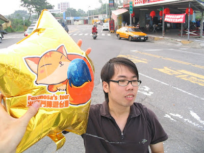](http://picasaweb.google.com/yurenju/Foxmosa/photo?authkey=hsQPgb8s_d8#5228433893410348322)  
**宅哥：喔喔喔！摸到火狐氣球感覺可以上網沖浪耶…**  
  
其實 228 紀念碑是一個有紀念價值的景點，不過特定節日的時候到這邊可能會更有意義。平常是屬於比較車水馬龍的地方。  
  
  
[檢視較大的地圖](http://maps.google.com.tw/?ie=UTF8&t=k&ll=23.463153,120.471209&spn=0.001722,0.00228&z=18&source=embed)  
  
衛星圖中間那個三角形就是 228 紀念碑，兩旁都是馬路，車還蠻多的。  
  
[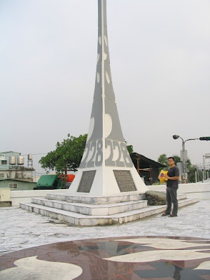](http://picasaweb.google.com/yurenju/Foxmosa/photo?authkey=hsQPgb8s_d8#5228433826848478642)  
  
後來我們到了[嘉義公園](http://zh.wikipedia.org/wiki/%E5%98%89%E7%BE%A9%E5%85%AC%E5%9C%92)。嘉義公園是一個在嘉義市區非常大的公園，根據維基百科上的資料嘉義公園佔地 268,000 平方公尺。每次逛嘉義公園的時候都會讓我感到腳酸阿…。  
  
[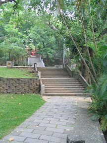](http://picasaweb.google.com/yurenju/Foxmosa/photo?authkey=hsQPgb8s_d8#5228434037815635234) [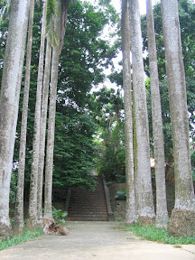](http://picasaweb.google.com/yurenju/Foxmosa/photo?authkey=hsQPgb8s_d8#5228434145867134530)  
  
而且這個公園裏面還有森林步道，可別小看了公園喔。不過我拍照的時候兩位同學真是超級不專心的阿…，同學！照相的時候看我這阿！！  
  
[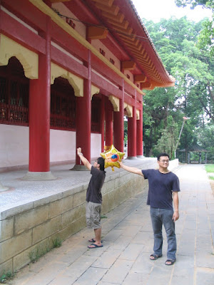](http://picasaweb.google.com/yurenju/Foxmosa/photo?authkey=hsQPgb8s_d8#5228434183430319106)  
  
  
嘉義公園還有個很特別的溜滑梯…  
  
[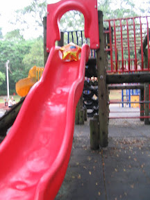](http://picasaweb.google.com/yurenju/Foxmosa/photo?authkey=hsQPgb8s_d8#5228434214152600786)  
  
當然不是這個，太小兒科啦。真正的男子漢要滑超大的溜滑梯！  
[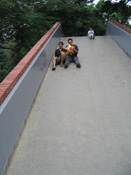](http://picasaweb.google.com/yurenju/Foxmosa/photo?authkey=hsQPgb8s_d8#5228434239234762690) [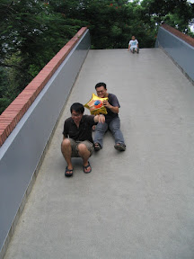](http://picasaweb.google.com/yurenju/Foxmosa/photo?authkey=hsQPgb8s_d8#5228434301061323650) [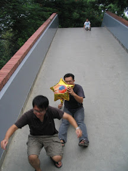](http://picasaweb.google.com/yurenju/Foxmosa/photo?authkey=hsQPgb8s_d8#5228434396324311490) [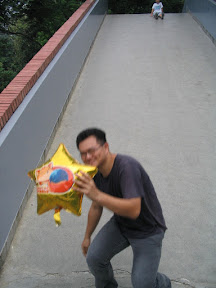](http://picasaweb.google.com/yurenju/Foxmosa/photo?authkey=hsQPgb8s_d8#5228434422533566978)  
  
而且功夫熊貓有什麼好看的？我們這邊有功夫阿宅呢！！  
  
[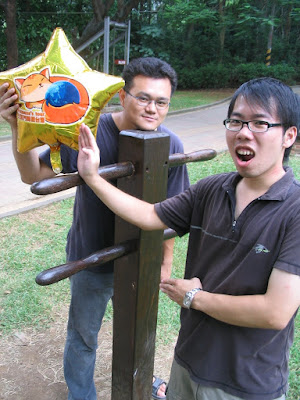](http://picasaweb.google.com/yurenju/Foxmosa/photo?authkey=hsQPgb8s_d8#5228434456036588050)  
  
在此介紹第二位同行的朋友(左) - 阿憲。他也是我同研究室的朋友，是個年輕有為又喜歡看動畫的人！當然也是 Firefox 使用者~  
  
科科，所以其實我們的嘉義公園之行都是在惡搞啦。  
  
[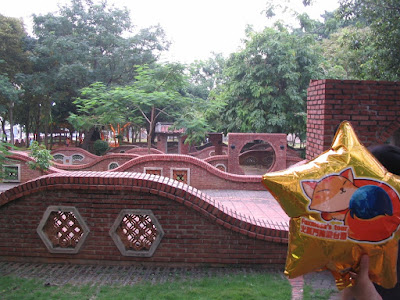](http://picasaweb.google.com/yurenju/Foxmosa/photo?authkey=hsQPgb8s_d8#5228434620888015586)  
  
不過嘉義真的是一個很不錯的地方。在這邊念兩年的碩士班，我常常往阿里山跑。看了奮起湖冬螢、阿里山日出、大凍山日出。在嘉義生活的日子真的很棒，讓我的碩士班生涯特別充實阿！  
  
阿阿…離題了，歡迎各位到嘉義玩囉！Foxmosa 旅行團也告一個段落囉。最後讓我們在射日塔前一起歡呼~ Firefox 萬歲啦！！  
  
[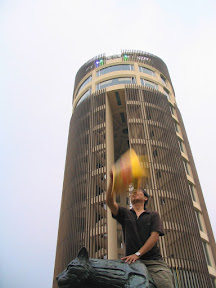](http://picasaweb.google.com/yurenju/Foxmosa/photo?authkey=hsQPgb8s_d8#5228434483350355842)  [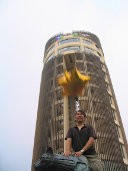](http://picasaweb.google.com/yurenju/Foxmosa/photo?authkey=hsQPgb8s_d8#5228434555554229922) [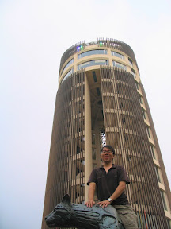](http://picasaweb.google.com/yurenju/Foxmosa/photo?authkey=hsQPgb8s_d8#5228434530052542930)  
  
最後讓小弟 (左) 露個臉吧！順便廣告一下，我是 Debian/Ubuntu Linux 的使用者，歡迎 Firefox 的同好也可以試試 Linux，很好玩的唷！  
  
[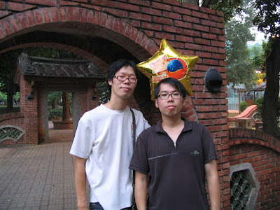](http://picasaweb.google.com/yurenju/Foxmosa/photo?authkey=hsQPgb8s_d8#5228434584952143778)