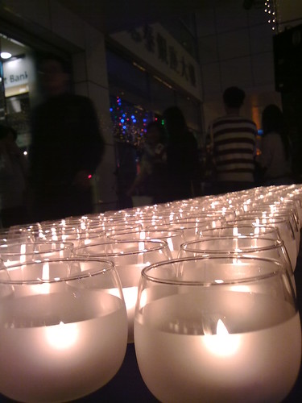
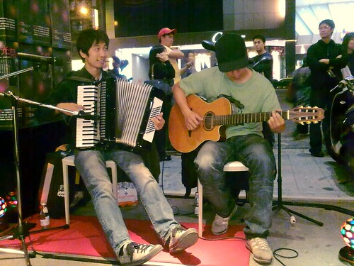
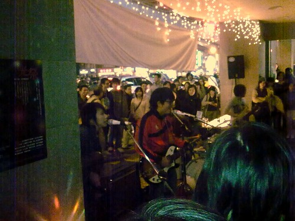

  
  
數一數這只是我到台北後參加的第五場音樂活動，不知道是幸還不幸，不過每個週末都剛好會有活動可以填進去。所以才沒參加太多音樂活動。這次又去了光祭！主要目標是一、王雁盟！二、自然捲奇哥。王雁盟的演出真是自然又隨性阿，看著他跟吉他手不停的眼神交錯，真覺得他們這次的表演應該有很多很多的即興演出。前面一、二首暖場後，後面的曲目跟吉他手就有很密切的來往，感覺起來就像兩個人在尬音樂的感覺。時而緊湊的音樂節奏還蠻能抓住聽眾的情緒的。  
  
  
  
不過禮拜五就應該這樣阿～空下時間聽聽悠閒地音樂，偶爾聊個天，真的是很棒。不過時間一下子就結束了，總覺得還沒聽多久就最後一首了，真可惜。  
  
  
  
當然不能忘記奇哥，不過我們中途走錯方向，所以只聽到最後兩首『計程車』跟『買』。奇哥還是充滿活力阿。不過今天跟我一樣也感冒了。不過應該可以看到奇哥更有活力的演出吧！